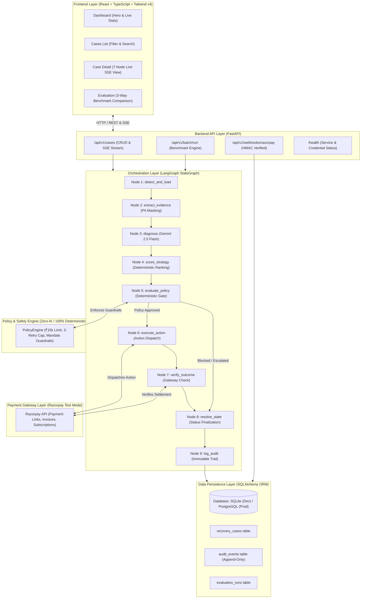

# AI Revenue Recovery Orchestrator — Project Masterclass

> **Document Type**: Comprehensive Architectural & Conceptual Guide  
> **Target Audience**: Engineers owning, explaining, interviewing on, or extending this project  
> **Repository**: [`sreeram110909/ai-revenue-recovery-orchestrator`](file:///Users/sreerambanoth/Documents/ai-revenue-recovery-orchestrator)  
> **Language**: Plain English, code-grounded, zero unexplained jargon

---

## Table of Contents
1. [Part 0 — The 60-Second Version & Core Vocabulary](#part-0--the-60-second-version)
2. [Part 1 — The Problem (Why Payments Fail & Cost Millions)](#part-1--the-problem)
3. [Part 2 — The Solution (Mental Model)](#part-2--the-solution)
4. [Part 3 — Word-by-Word Engineering Glossary](#part-3--word-by-word-glossary)
5. [Part 4 — Architecture, Layer by Layer](#part-4--architecture-layer-by-layer)
6. [Part 5 — Walkthrough: Tracing a Real Payment Failure](#part-5--follow-one-payment-failure-through-the-whole-system)
7. [Part 6 — UI Walkthrough, Screen by Screen](#part-6--ui-walkthrough-screen-by-screen)
8. [Part 7 — Why It Was Built This Way (Trade-offs & Lessons)](#part-7--why-it-was-built-this-way)
9. [Part 8 — Explain-It-Yourself Scripts](#part-8--explain-it-yourself-script)
10. [Part 9 — FAQ & Hard Interview Questions](#part-9--faq--gotchas-people-will-ask)
11. [Part 10 — Quick-Reference Index](#part-10--quick-reference-index)

---

## Part 0 — The 60-Second Version

### The Elevator Paragraph (Say This Out Loud)
> *"When people buy things online or pay recurring subscriptions, up to 10% of payments fail due to bank timeouts, expired cards, or glitchy OTPs. Most companies blindly spam the bank with retries or simply give up and lose the money. Our project is an autonomous system that catches failed payments in real time. It uses Google Gemini to read the error codes and figure out why the payment failed, scores the best recovery strategy (like sending an instant payment link or scheduling a smart retry), validates that choice through a 100% deterministic policy engine with strict safety guardrails, executes the action through Razorpay, and independently verifies whether the money actually settled. In our 60-case benchmark, it recovered ₹1,12,529.40—a 117.4% improvement over naive retries—with zero policy violations."*

---

### Foundational Terminology (Every Term Defined Up Front)

Before diving into code, here is what every single term means in plain English:

- **Orchestrator**: A master controller program that directs several specialized tools in order, making sure each step finishes before the next begins. *Analogy*: An orchestra conductor directing musicians who don't talk to each other.
- **Agent**: A piece of software powered by an AI model (like Google Gemini) that is given a specific role, context, and instructions to analyze data and produce a structured suggestion.
- **Workflow**: A defined sequence of steps that a piece of data moves through from start to finish.
- **Node**: A single, self-contained function or station inside a workflow graph.
- **State**: The complete snapshot of data held in memory at any point during a program's execution.
- **Graph**: A map of connected stations (nodes) and paths (edges) describing all possible directions a workflow can travel.
- **LangGraph**: An open-source Python library used to build step-by-step, stateful, multi-node workflows and state machines with built-in checkpointing and branching.
- **Policy Engine**: A rigid, rule-based software component containing hard business limits (like *"never auto-retry more than 3 times"*). It contains zero AI and makes deterministic yes/no decisions.
- **Strategy**: A specific recovery action chosen for a case (e.g., `PAYMENT_LINK`, `SMART_RETRY`, `UPDATE_PAYMENT_METHOD`, `HUMAN_ESCALATION`, `STOP`).
- **Recovery**: Successfully turning a failed payment transaction into a paid, settled transaction.
- **Verification**: The independent act of asking the payment gateway (Razorpay) *"did the customer actually pay?"* rather than trusting that sending a link means you got paid.
- **Reconciliation**: Comparing internal business accounting records against external bank records to confirm that the money actually arrived in the bank account.
- **Webhook**: An automated HTTP message that a service (like Razorpay) sends to your server to notify it that an event happened (e.g., *"Customer just paid link #plink_123"*).
- **Idempotency**: A property of an operation meaning you can run it 100 times with the same input, and it will produce the exact same result as running it once, without creating duplicates or double charges.
- **Audit Log**: An immutable, append-only chronological diary where every action, decision, status change, and error is recorded with a timestamp.
- **Provenance**: The verifiable origin or source of a data point (e.g., whether a recovery was proven by a real live API call, a mocked unit test, or a synthetic benchmark simulation).
- **Synthetic Dataset**: A realistically generated test dataset containing simulated customer and failure data designed to test edge cases without exposing real customer personally identifiable information (PII).
- **Benchmark**: A standardized test run on a fixed dataset used to measure and compare performance under identical conditions.
- **Baseline**: The standard or default way of doing things used as a benchmark comparison point (in this project: *No Action* and *Retry Only*).
- **SSE (Server-Sent Events)**: A web technology allowing a server to push real-time text updates down an open HTTP connection to a browser without the browser repeatedly asking for updates.
- **EventSource**: The standard JavaScript browser API used to listen to Server-Sent Events.
- **API (Application Programming Interface)**: A structured set of HTTP URLs and formats allowing the frontend React app to talk to the backend Python server.
- **Endpoint / Route**: A specific URL path exposed by the backend (e.g., `GET /api/v1/cases` or `POST /api/v1/batch/run`).
- **Schema**: A strict blueprint or data model defining the exact field names, types (string, number, boolean), and validation rules that data must adhere to.
- **Repository**: A software layer whose only job is reading and writing data models to the database.
- **ORM (Object-Relational Mapping)**: A tool (like SQLAlchemy) that lets you interact with database tables using Python classes instead of writing raw SQL strings.
- **Persistence**: Saving data to a durable storage medium (like SQLite or PostgreSQL on a hard disk) so it isn't lost when the server restarts.
- **State Machine**: A mathematical computation model that can only be in one of a finite number of named "states" at any time, transitioning between them based on strict rules.
- **Fallback**: A backup mechanism that automatically activates when a primary component (like an external AI API) fails or times out.
- **Mock**: A simulated object that mimics the behavior of a real external system (like Razorpay) in automated tests without making real network calls.
- **Test Mode**: A sandboxed environment provided by payment gateways (like Razorpay) allowing developers to test API calls with fake cards and zero real financial charges.
- **LLM (Large Language Model)**: A deep learning model (like Gemini 2.5 Flash) trained on language that can understand error messages, summarize evidence, and classify failures.
- **Inference**: The process of running an AI model on an input prompt to produce an output prediction or diagnosis.
- **Confidence**: A statistical score between 0.0 and 1.0 indicating how certain the model is about its classification.
- **Escalation**: Routing a high-risk, high-value, or ambiguous failure to a human operations team for manual review rather than acting automatically.
- **Terminal State**: A final, irreversible status in a workflow (e.g., `VERIFIED_RECOVERED`, `ESCALATED`, `STOPPED`, `CLOSED_UNRECOVERABLE`) after which no further automated operations are allowed.
- **Retry**: Submitting a payment request again to the gateway.
- **Dispatch**: The moment an automated recovery action (like creating a payment link) is sent out to the customer or payment gateway.
- **Settlement**: The final stage of payment processing where funds are officially transferred from the customer's bank to the merchant's bank.
- **Recovery Rate (Revenue %)**: `(Total Verified Recovered INR / Total INR at Risk) * 100`.
- **Case Recovery Rate (Case %)**: `(Count of Recovered Cases / Total Failed Cases) * 100`.
- **Revenue at Risk**: The total financial sum of all transactions that failed and would be lost if no action were taken.

---

## Part 1 — The Problem

### What is a "Failed Payment"?
When a customer clicks *"Pay ₹2,500"* on an e-commerce checkout or when Netflix attempts to charge a monthly subscription, the transaction travels through a complex web:
1. Customer's browser / app
2. Merchant's backend
3. Payment Gateway (e.g., Razorpay)
4. Card Network (Visa/Mastercard/NPCI)
5. Issuing Bank (Customer's bank)
6. Acquiring Bank (Merchant's bank)

If **any single link** in that chain fails, the transaction is rejected. The merchant receives an error code (such as `BAD_REQUEST_ERROR`, `GATEWAY_ERROR`, or `TRANSACTION_DECLINED`).

```
[ Customer ] ──> [ Merchant ] ──> [ Razorpay ] ──> [ Card Network ] ──> [ Issuing Bank ]
                                                                             │ (Fails!)
                                                                             ▼
[ Revenue Lost ] <── [ Unhandled Error ] <── [ Gateway Error Code ] <────────┘
```

### Why Payments Fail in the Real World
Payment failures fall into specific, recognizable categories:
- **`BANK_TIMEOUT_NETWORK`**: The bank's servers were overloaded or network packets dropped. The customer has money, but the connection timed out.
- **`INSUFFICIENT_FUNDS`**: The customer's account balance was below the transaction amount at the exact moment of billing (common during month-end or subscription renewals).
- **`AUTHENTICATION_OTP_FAILURE`**: The customer received an SMS OTP too late, mistyped it, or closed the 3D-Secure browser window before authorization completed.
- **`EXPIRED_INSTRUMENT`**: The credit/debit card on file reached its expiry date.
- **`MANDATE_EXPIRED_INVALID`**: The RBI-compliant recurring e-mandate for a subscription expired or was revoked.
- **`RISK_SECURITY_BLOCK`**: The bank flagged the transaction as potential fraud due to unusual location, velocity, or IP address.

### The Real Cost: Why Merchants Lose Millions
If a merchant does nothing, **100% of failed revenue is lost**. If a merchant uses naive *"dumb"* retries:
1. Retrying an expired card or security block will fail 100% of the time, damaging the merchant's reputation with card networks and incurring gateway penalty fees.
2. Retrying too quickly (e.g., within 5 seconds of a bank outage) immediately fails again, exhausting retry limits.
3. High-value transactions (e.g., ₹50,000 B2B invoices) get lost without human oversight.

### Worked Scale Example from Our Benchmark Dataset
In this project's canonical 60-case benchmark dataset ([`data/evaluations/datasets/recovery_dataset_v1_seed42.json`](file:///Users/sreerambanoth/Documents/ai-revenue-recovery-orchestrator/data/evaluations/datasets/recovery_dataset_v1_seed42.json)):

| Benchmark Metric | No Action (Baseline 1) | Retry Only (Baseline 2) | AI Orchestrator (Our Project) |
|---|---|---|---|
| **Total Revenue at Risk** | ₹5,21,769.70 | ₹5,21,769.70 | ₹5,21,769.70 |
| **Verified Recovered Revenue** | **₹0.00** | **₹51,765.46** | **₹1,12,529.40** |
| **Revenue Recovery Rate** | 0.0% | 9.9% | **21.6%** |
| **Cases Recovered** | 0 / 60 (0.0%) | 20 / 60 (33.3%) | **32 / 60 (53.3%)** |
| **Absolute Financial Lift** | — | Baseline | **+₹60,763.94 (+117.4% lift)** |
| **Policy Violations** | 0 | 0 | **0 (100% compliant)** |
| **Human Escalations** | 0 | 8 | **16 cases safely escalated** |

---

## Part 2 — The Solution

The AI Revenue Recovery Orchestrator solves this by handling failed payments through a disciplined, 5-stage pipeline:

```
[ Stage 1: Ingest & Scrub ] ──> [ Stage 2: Diagnose ] ──> [ Stage 3: Policy Gate ] ──> [ Stage 4: Execute ] ──> [ Stage 5: Verify ]
```

1. **Stage 1: Detect & Scrub (Ingestion)**  
   When a payment fails, the system ingests the raw error payload. It scrubs all Personally Identifiable Information (PII)—masking emails to `j***@example.com` and stripping raw credit card numbers and server secrets—before anything reaches memory or an AI model.

2. **Stage 2: Diagnose & Score (AI Advisory)**  
   Google Gemini analyzes the sanitized failure code, customer payment history, and retry attempts. It identifies the root cause (e.g., *"Transient network timeout at HDFC bank"*) and suggests candidate strategies. A deterministic scorer ranks the strategies by probability of success.

3. **Stage 3: Authorize (Deterministic Policy Gate)**  
   The AI's suggestion is passed to a hard-coded Python Policy Engine with **zero AI**. The policy engine checks hard business guardrails: Is the amount > ₹15,000? Has the case exceeded 3 retries? Is it a security block? The policy engine has absolute authority to **ALLOW**, **DOWNGRADE** (e.g., change an auto-retry to a payment link), **BLOCK**, or **ESCALATE** to a human.

4. **Stage 4: Dispatch (Action Execution)**  
   If and only if the policy engine approves an automated action, the execution service calls the Razorpay API to perform the exact approved action—such as creating an instant Razorpay Payment Link or scheduling a subscription invoice retry.

5. **Stage 5: Verify & Reconcile (Independent Truth)**  
   The system **never** marks revenue as recovered simply because an action was dispatched or an API returned HTTP 200. Instead, it queries Razorpay's payment state or waits for a cryptographically verified webhook. Only when the gateway explicitly confirms `status == "paid"` or `status == "captured"` is the money booked as recovered.

---

## Part 3 — Word-by-Word Glossary

| Term | Literal Word Breakdown | General Software Engineering Meaning | Specific Meaning in This Project |
|---|---|---|---|
| **Orchestrator** | *Orchestra* (group of musicians) + *-or* (one who conducts). | A central coordination service that invokes microservices or functions in a specific order. | The LangGraph pipeline ([`builder.py`](file:///Users/sreerambanoth/Documents/ai-revenue-recovery-orchestrator/backend/app/orchestrator/builder.py)) that guides a failed payment through 9 nodes from detection to verification. |
| **LangGraph** | *Language* (LLM) + *Graph* (network of nodes). | A Python framework from LangChain for building stateful, multi-actor applications with LLMs as state machines. | The engine driving our workflow, maintaining the `RecoveryWorkflowState` TypedDict across execution steps. |
| **Node** | Latin *nodus* (knot or connection point). | A single computational step or discrete unit of work in a graph or tree. | One of 9 functions in [`nodes.py`](file:///Users/sreerambanoth/Documents/ai-revenue-recovery-orchestrator/backend/app/orchestrator/nodes.py) (e.g., `diagnose`, `evaluate_policy`, `execute_action`). |
| **State Machine** | *State* (current condition) + *Machine* (system). | A model where a program is always in one named condition and moves between them via defined transitions. | The rigid progression of a case: `DETECTED` → `DIAGNOSED` → `RETRY_SCHEDULED` / `PAYMENT_LINK_CREATED` → `VERIFIED_RECOVERED` / `ESCALATED` / `STOPPED`. |
| **Checkpointing** | *Checkpoint* (a point of recording progress). | Saving intermediate state at every node transition so execution can be inspected or resumed. | Managed by LangGraph's `InMemorySaver` (in demo) or PostgreSQL checkpointer using a unique `thread_id`. |
| **Policy Engine** | *Policy* (rule/principle) + *Engine* (processor). | A rules evaluation engine that takes inputs and checks them against business constraints without machine learning. | [`engine.py`](file:///Users/sreerambanoth/Documents/ai-revenue-recovery-orchestrator/backend/app/policies/engine.py): 100% deterministic Python rules enforcing ₹15k amount caps, 3-retry limits, and security locks. |
| **Deterministic** | Latin *determinare* (to fix or limit). | Given the exact same input, the software will **always** produce the exact same output, with 0% randomness. | The guarantee that the Policy Engine and Strategy Scorer will never make different decisions for the same case. |
| **Idempotency** | Latin *idem* (same) + *potentia* (power). | The quality of an API or function where repeated identical requests have the exact same effect as a single request. | Preventing duplicate audit events (Incident 1 fix) and duplicate Razorpay payment links if a case is reprocessed. |
| **Webhook** | *Web* (HTTP) + *Hook* (intercepting trigger). | An HTTP POST request sent by a third-party service (like Razorpay) to your server when an event occurs. | [`webhooks.py`](file:///Users/sreerambanoth/Documents/ai-revenue-recovery-orchestrator/backend/app/routers/webhooks.py): Listens for `payment_link.paid` and `invoice.paid` with HMAC-SHA256 signature verification. |
| **Payment Gateway** | *Payment* + *Gateway* (entrance/portal). | A merchant service that authorizes credit card or direct payment processing for e-businesses. | **Razorpay**: Used in Test Mode to generate payment links, manage subscription retries, and check payment status. |
| **Mandate** | Latin *mandatum* (authorization/order). | A recurring payment permission registered with a customer's bank (e.g., UPI Autopay / e-NACH). | An authorization required for subscription charges. If expired, auto-retrying is illegal under RBI rules. |
| **Dispatch** | Old French *despechier* (to send off). | Sending an instruction or API call to an external service. | Sending a `POST /v1/payment_links` call to Razorpay to dispatch a payment link to a customer. |
| **Escalation** | Latin *scala* (ladder — to climb up). | Passing an issue to a higher level of authority or human intervention. | Changing a case's status to `ESCALATED` and assigning it to operations when policy detects high value or fraud risk. |
| **Verification** | Latin *verus* (true) + *facere* (to make). | Proving whether an expected event actually happened against an authoritative external source. | [`verification_service.py`](file:///Users/sreerambanoth/Documents/ai-revenue-recovery-orchestrator/backend/app/services/verification_service.py): Querying Razorpay to confirm `status == "paid"` before booking revenue. |
| **Baseline** | *Base* (bottom) + *Line* (reference mark). | A minimal standard measurement against which all new experimental results are compared. | The two standard industry practices: **No Action** (0% recovery) and **Retry Only** (9.9% recovery). |
| **Benchmark** | *Bench* (surveyor's table) + *Mark*. | A structured evaluation test run across a fixed dataset to measure accuracy, speed, and financial yield. | The 60-case synthetic dataset test executed via `POST /api/v1/batch/run` comparing 3 strategies. |
| **Seed** | Old English *sæd* (origin/source). | An initial number passed to a pseudo-random generator to ensure it generates the exact same numbers every time. | `seed=42`: Guarantees that our 60 synthetic failure cases generate identical amounts, codes, and customer IDs every time. |
| **Synthetic Data** | Greek *synthetikos* (put together/artificial). | Artificially manufactured data that mirrors the statistical properties of real data without containing real user info. | The 60 test cases in [`recovery_dataset_v1_seed42.json`](file:///Users/sreerambanoth/Documents/ai-revenue-recovery-orchestrator/data/evaluations/datasets/recovery_dataset_v1_seed42.json). |
| **Recovery Rate** | *Recover* + *Rate* (proportion). | The percentage of failed revenue successfully recovered. | Formula: `(Verified Recovered INR / Total INR at Risk) * 100`. |
| **Case Rate** | *Case* (unit) + *Rate*. | The percentage of failed transactions resolved. | Formula: `(Recovered Case Count / Total Case Count) * 100`. |
| **CORS** | *Cross-Origin Resource Sharing*. | A browser security mechanism that blocks web pages on one domain (localhost:3000) from talking to another (localhost:8000). | Configured in FastAPI [`main.py`](file:///Users/sreerambanoth/Documents/ai-revenue-recovery-orchestrator/backend/app/main.py#L85-L91) with `CORSMiddleware` to allow frontend-backend communication. |
| **SSE** | *Server-Sent Events*. | A one-way persistent HTTP connection where a server streams real-time messages to a web client. | Used in `GET /api/v1/cases/{id}/process/stream` to animate the 7 LangGraph nodes in real-time on the UI. |

---

## Part 4 — Architecture, Layer by Layer

### System Architecture Diagram



---

### Layer-by-Layer Breakdown

#### 1. Frontend Layer (React 19 + Vite + Tailwind CSS v4)
- **Location**: [`src/`](file:///Users/sreerambanoth/Documents/ai-revenue-recovery-orchestrator/src)
- **What it does**: Renders the merchant operations console across 4 primary views: Dashboard, Cases, Case Detail, and Evaluation.
- **Why it's separate**: Keeps the UI responsive and decoupled from heavy backend orchestration.
- **What breaks if missing**: Merchants have zero visual oversight of automated recovery decisions, manual escalation queues, or financial benchmarks.

#### 2. Backend API Layer (FastAPI)
- **Location**: [`backend/app/main.py`](file:///Users/sreerambanoth/Documents/ai-revenue-recovery-orchestrator/backend/app/main.py), [`backend/app/routers/`](file:///Users/sreerambanoth/Documents/ai-revenue-recovery-orchestrator/backend/app/routers)
- **What it does**: Exposes validated REST endpoints and SSE streams. Handles request serialization via Pydantic schemas and database session lifecycle.
- **Why it's separate**: Acts as the secure perimeter. Frontend clients never touch database queries, Gemini API keys, or Razorpay secrets.
- **What breaks if missing**: Direct exposure of backend secrets to the browser, violating PCI-DSS security compliance.

#### 3. AI Diagnosis Agent (Google Gemini 2.5 Flash)
- **Location**: [`backend/app/agents/diagnosis.py`](file:///Users/sreerambanoth/Documents/ai-revenue-recovery-orchestrator/backend/app/agents/diagnosis.py)
- **What it does**: Ingests sanitized failure evidence and classifies the underlying root cause into one of 7 structured failure categories with an explanatory rationale.
- **Why it's strictly advisory**: LLMs are probabilistic and prone to hallucinations. In financial systems, an AI must **never** have direct authority to move money or override policies.

#### 4. Policy Engine (100% Deterministic Rule Engine)
- **Location**: [`backend/app/policies/engine.py`](file:///Users/sreerambanoth/Documents/ai-revenue-recovery-orchestrator/backend/app/policies/engine.py)
- **What it does**: Enforces non-negotiable business guardrails:
  - Max retry cap (≤ 3 attempts)
  - Retry cooldown interval (≥ 4 hours)
  - Amount limit for autonomous actions (≤ ₹15,000)
  - Non-retryable rule enforcement (Security blocks, expired cards)
- **Why it's separate from the AI**: This is the core architectural principle: **"AI proposes, Policy decides."** If Gemini hallucinates that an expired card should be retried 10 times, the Policy Engine rejects it instantly.

#### 5. Payment Gateway Integration (Razorpay Test Mode)
- **Location**: [`backend/app/services/razorpay_service.py`](file:///Users/sreerambanoth/Documents/ai-revenue-recovery-orchestrator/backend/app/services/razorpay_service.py)
- **What it does**: Interacts with Razorpay's REST API using Basic Auth (`RAZORPAY_KEY_ID:RAZORPAY_KEY_SECRET`) to create Payment Links, manage subscriptions, and verify payment settlements.
- **Why it's separate**: Isolates gateway-specific SDK logic. If the business switches from Razorpay to Stripe, only this adapter changes.

#### 6. Persistence & Audit Layer (SQLAlchemy + SQLite/Postgres)
- **Location**: [`backend/app/models/`](file:///Users/sreerambanoth/Documents/ai-revenue-recovery-orchestrator/backend/app/models), [`backend/app/repositories/`](file:///Users/sreerambanoth/Documents/ai-revenue-recovery-orchestrator/backend/app/repositories)
- **What it does**: Persists case records and maintains an immutable, append-only audit trail in the `audit_events` table.
- **Why it's separate**: Ensures durable record-keeping so server reboots or network drops never lose transaction history.

---

## Part 5 — Follow One Payment Failure Through the Whole System

Let us trace a real case from our benchmark dataset: **`synth_v1.0_42_001`** (a **₹2,500.00** one-time payment failure due to **`BANK_TIMEOUT_NETWORK`**).

```
[ Ingest Case ] ──> [ Mask PII ] ──> [ Gemini Diagnoses ] ──> [ Scorer Ranks ] ──> [ Policy Allows ] ──> [ Dispatch Link ] ──> [ Verify Paid ]
```

---

### Step 1: Ingestion & Loading (`Node 1: detect_and_load`)
- **File**: [`backend/app/orchestrator/nodes.py`](file:///Users/sreerambanoth/Documents/ai-revenue-recovery-orchestrator/backend/app/orchestrator/nodes.py#L50-L97)
- **Function**: `WorkflowNodes.detect_and_load(state)`

The failed payment enters the workflow. The node verifies that the case exists and logs an initial `CASE_INGESTED` event into the audit trail with idempotency protection.

```python
# Real code from backend/app/orchestrator/nodes.py
def detect_and_load(self, state: Dict[str, Any]) -> Dict[str, Any]:
    case: Optional[RecoveryCase] = state.get("case")
    if not case:
        return {"error": "Case not found", "final_state": CaseStatus.CLOSED_UNRECOVERABLE}

    # Audit CASE_INGESTED only if not already recorded (Idempotency fix)
    already_ingested = False
    if self.audit_service and self.audit_service.repository:
        existing_audit = self.audit_service.repository.get_by_case_id(case.id)
        already_ingested = any(a.event_type == "CASE_INGESTED" for a in existing_audit)

    if not already_ingested:
        self.audit_service.log_event(
            case_id=case.id,
            event_type="CASE_INGESTED",
            actor="SYSTEM",
            previous_status=case.current_status,
            new_status=case.current_status,
            details={"case_type": case.case_type.value, "amount": case.amount},
            provenance=provenance,
        )
    return {"case_id": case.id, "case": case, ...}
```
*Why it's written this way*: An existence check prevents creating 300+ duplicate audit rows if the case is ingested repeatedly during retries or webhook deliveries.

---

### Step 2: Evidence Scrubbing & PII Redaction (`Node 2: extract_evidence`)
- **File**: [`backend/app/agents/evidence.py`](file:///Users/sreerambanoth/Documents/ai-revenue-recovery-orchestrator/backend/app/agents/evidence.py#L35-L65)
- **Function**: `extract_evidence(case)`

The raw case data contains customer email addresses and identifiers. Before any AI model sees the payload, `extract_evidence` sanitizes the data:

```python
# Real code from backend/app/agents/evidence.py
def extract_evidence(case: RecoveryCase) -> Dict[str, Any]:
    return {
        "case_id": case.id,
        "case_type": case.case_type.value,
        "amount": case.amount,
        "currency": case.currency,
        "failure_code": case.failure_code,
        "failure_category": case.failure_category.value,
        "attempts_count": case.attempts_count,
        "max_attempts_allowed": case.max_attempts_allowed,
        "customer_segment": case.customer_segment,
        "masked_email": case.masked_customer_email,  # e.g., "a***@example.com"
        "error_description": case.error_description,
    }
```
*Why it's written this way*: PCI-DSS and privacy regulations strictly forbid sending raw customer credit card details or unmasked emails to third-party LLM cloud APIs.

---

### Step 3: Bounded AI Diagnosis (`Node 3: diagnose`)
- **File**: [`backend/app/agents/diagnosis.py`](file:///Users/sreerambanoth/Documents/ai-revenue-recovery-orchestrator/backend/app/agents/diagnosis.py#L225-L335)
- **Function**: `DiagnosisAgent.diagnose(case)`

Gemini 2.5 Flash analyzes the sanitized failure context. If the API key is missing or the network drops, it automatically activates the deterministic `_FALLBACK_RULES`:

```python
# Real code from backend/app/agents/diagnosis.py
if not self.api_key:
    return self._fallback_diagnosis(case)

# Prompt execution with Gemini structured JSON output
response = self.model.generate_content(
    prompt,
    generation_config={"response_mime_type": "application/json"}
)
result_data = json.loads(response.text)
```
**Output for `synth_v1.0_42_001`**:
- **Diagnosis**: *"Payment failed due to an upstream bank timeout at the issuing network."*
- **Failure Category**: `BANK_TIMEOUT_NETWORK`
- **Candidate Strategies**: `["SMART_RETRY", "PAYMENT_LINK"]`
- **Confidence**: `0.85`

---

### Step 4: Deterministic Strategy Scoring (`Node 4: score_strategy`)
- **File**: [`backend/app/agents/strategy_scorer.py`](file:///Users/sreerambanoth/Documents/ai-revenue-recovery-orchestrator/backend/app/agents/strategy_scorer.py#L80-L140)
- **Function**: `StrategyScorer.score(case, diagnosis)`

Scores candidate strategies mathematically based on attempts remaining, customer segment, and failure category:
- `SMART_RETRY` Score: `0.92` (Attempt 1 of 3, cooldown satisfied)
- `PAYMENT_LINK` Score: `0.75`
- `HUMAN_ESCALATION` Score: `0.10`
- **Recommended Strategy**: `SMART_RETRY`

---

### Step 5: Deterministic Policy Gate (`Node 5: evaluate_policy`)
- **File**: [`backend/app/policies/engine.py`](file:///Users/sreerambanoth/Documents/ai-revenue-recovery-orchestrator/backend/app/policies/engine.py#L32-L70)
- **Function**: `PolicyEngine.evaluate(case, proposed_strategy)`

The Policy Engine checks all 4 hard guardrails:
1. **Status Freeze**: Case is `DIAGNOSED` (Not in a terminal state) → **PASS**
2. **Amount Threshold**: ₹2,500.00 ≤ ₹15,000.00 → **PASS**
3. **Category Guardrail**: `BANK_TIMEOUT_NETWORK` is retryable → **PASS**
4. **Retry Limit Cap**: Attempt 1 < 3 → **PASS**

```python
# Real code from backend/app/policies/engine.py
if all_rules_passed:
    return self._build_result(
        outcome=PolicyOutcome.ALLOW,
        passed=True,
        proposed_strategy=proposed_strategy,
        approved_strategy=proposed_strategy,
        evaluations=evaluations,
        reasons=["All policy rules passed. Strategy approved."],
        timestamp=now,
    )
```
**Policy Decision**: `outcome = "ALLOW"`, `approved_strategy = "SMART_RETRY"`.

---

### Step 6: Action Dispatch (`Node 6: execute_action`)
- **File**: [`backend/app/services/execution_service.py`](file:///Users/sreerambanoth/Documents/ai-revenue-recovery-orchestrator/backend/app/services/execution_service.py#L43-L120)
- **Function**: `ExecutionService.execute_policy_approved_action()`

Because policy allowed `SMART_RETRY`, the execution service schedules the retry with a 4-hour cooldown and creates a tracking record:

```python
# Real code from backend/app/services/execution_service.py
case.current_status = CaseStatus.RETRY_SCHEDULED
case.next_retry_at = datetime.utcnow() + timedelta(hours=4)
case.attempts_count += 1
```
*Notice*: Revenue is **not** marked as recovered here. `verified_recovered_amount` remains `0.0`.

---

### Step 7: Gateway Verification (`Node 7: verify_outcome`)
- **File**: [`backend/app/services/verification_service.py`](file:///Users/sreerambanoth/Documents/ai-revenue-recovery-orchestrator/backend/app/services/verification_service.py#L45-L95)
- **Function**: `VerificationService.verify_recovery_outcome()`

When the retry executes or customer pays via payment link, the verification service queries Razorpay:

```python
# Real code from backend/app/services/verification_service.py
if gateway_status in ["paid", "captured"]:
    case.verified_recovered_amount = case.amount  # Set to ₹2,500.00
    case.current_status = CaseStatus.VERIFIED_RECOVERED
else:
    case.verified_recovered_amount = 0.0
```

---

### Step 8: What Finally Appears on the UI
On the Case Detail page ([`src/pages/CaseView.tsx`](file:///Users/sreerambanoth/Documents/ai-revenue-recovery-orchestrator/src/pages/CaseView.tsx)):
- **Status Badge**: `VERIFIED_RECOVERED` (Jade Green `#2DBE8F`)
- **Recovered Amount**: `₹2,500.00`
- **Decision Flow**: All 7 steps marked completed with green indicators.
- **Activity Feed**: 10 immutable audit entries displayed in exact chronological order.

---

## Part 6 — UI Walkthrough, Screen by Screen

> **Frontend Architecture Note (Single URL & In-Memory State)**:  
> This application runs as a lightweight Single-Page Application (SPA) on a single browser URL (`http://localhost:3000`). Navigation between tabs is handled entirely in memory via React `useState` in [`src/App.tsx`](file:///Users/sreerambanoth/Documents/ai-revenue-recovery-orchestrator/src/App.tsx) (`currentTab: 'dashboard' | 'cases' | 'case-view' | 'evaluation'`). There is **no client-side routing library** (e.g., `react-router`), and URL paths are not synchronized to browser history. Refreshing the browser will always reset the UI back to the default Dashboard view; individual cases and tabs cannot be deep-linked or bookmarked via direct URL. This is an intentional simplicity choice for this prototype rather than a bug.

```
┌──────────────────────────────────────────────────────────────────────────────────────────────────┐
│  AI REVENUE RECOVERY ORCHESTRATOR           [Razorpay Test Mode]  [Gemini Ready]  [API Connected]│
├──────────────────────────────────────────────────────────────────────────────────────────────────┤
│  [Dashboard]          [Recovery Cases]          [Benchmark Evaluation]                           │
└──────────────────────────────────────────────────────────────────────────────────────────────────┘
```

---

### Screen 1: Dashboard (`src/pages/Dashboard.tsx`)
- **Navigation State**: Default active tab (`currentTab === 'dashboard'`)
- **Backend API Endpoints Called**:
  - `GET /api/v1/metrics/batch`: Returns canonical orchestrator recovery metrics and baseline comparisons.
  - `GET /api/v1/cases?limit=100`: Returns persisted cases in the SQLite/PostgreSQL database.

```
┌──────────────────────────────────────────────────────────────────────────────────────────────────┐
│  VERIFIED RECOVERED REVENUE                                                                      │
│  ₹1,12,529.40                                           Revenue uplift vs Retry Only             │
│  21.6% revenue recovery • 53.3% case recovery (32 of 60)  +₹60,763.94 (+117.4% lift)            │
│  ~~~~~~~~~~~~~~~~~~~~[ Recovery Pulse Waveform SVG ]~~~~~~~~~~~~~~~~~~~~~~~~~~~~~~~~~~~~~~~~~~~~ │
├───────────────────┬───────────────────┬──────────────────────┬───────────────────┬───────────────┤
│  Revenue at Risk  │ Recovery Attempts │ Successful Dispatches│ Human Escalations │Policy Violatns│
│  ₹5,21,769.70     │ 52                │ 44                   │ 16                │ 0             │
└───────────────────┴───────────────────┴──────────────────────┴───────────────────┴───────────────┘
```

#### Element-by-Element Breakdown:
1. **Top-Bar Health Badges**:
   - `Razorpay Test Mode` / `Razorpay Simulated`: Driven dynamically by `health.razorpay_configured`.
   - `Gemini Ready` / `Rule-Based Fallback`: Driven dynamically by `health.gemini_configured`.
   - `API Connected`: Green pulse when `GET /health` succeeds.
2. **Hero Card ("Verified Recovered Revenue")**:
   - **Large Currency Display (`₹1,12,529.40`)**: Total money verified as settled by Razorpay under the AI Orchestrator strategy.
   - **Recovery Pulse Waveform SVG**: Subtle jade green (`#2DBE8F`) heartbeat line that animates at 18–28% opacity behind the number.
   - **Revenue Uplift (`+₹60,763.94 / +117.4% lift`)**: Calculated dynamically as `Orchestrator Revenue (₹112,529.40) - Retry Only Revenue (₹51,765.46)`.
3. **5 Operational Stat Cards (All Distinct Bindings)**:
   - **Revenue at Risk (`₹5,21,769.70`)**: Sum of all 60 failed transaction amounts in the evaluation batch (`comparison?.total_revenue_at_risk`).
   - **Recovery Attempts (`52`)**: Total automated recovery actions attempted across all cases, including initial attempts and retries (`orchMetrics?.recovery_attempts`).
   - **Successful Dispatches (`44`)**: Count of recovery actions successfully dispatched and accepted by the gateway (`orchMetrics?.successful_actions`).
   - **Human Escalations (`16`)**: Count of cases routed to human review due to high value (>₹15,000) or non-retryable fraud risk (`orchMetrics?.human_escalations`).
   - **Policy Violations (`0`)**: Count of actions executed without policy approval (strictly 0 due to policy gate).
4. **3-Way Strategy Comparison Table**:
   - Renders a side-by-side comparison of **No Action**, **Retry Only**, and **AI Orchestrator**.

---

### Screen 2: Recovery Cases List (`src/pages/Cases.tsx`)
- **Navigation State**: Top-bar tab selection (`currentTab === 'cases'`)
- **Backend Endpoint**: `GET /api/v1/cases?limit=100`

```
┌──────────────────────────────────────────────────────────────────────────────────────────────────┐
│  Search: [ Search by case ID, customer ID, or email... ]  [All Workflows] [All Issues] [Filter] │
├─────────────────┬──────────────┬────────────────────────┬──────────┬──────────────┬──────────────┤
│  Case ID        │ Amount       │ Issue                  │ Attempts │ Strategy     │ Status       │
├─────────────────┼──────────────┼────────────────────────┼──────────┼──────────────┼──────────────┤
│  synth_42_001   │ ₹2,500.00    │ Bank Timeout Network   │ 1/3      │ SMART_RETRY  │ RECOVERED    │
│  synth_42_059   │ ₹18,400.00   │ Insufficient Funds     │ 0/3      │ ESCALATE     │ ESCALATED    │
│  synth_42_060   │ ₹4,200.00    │ Risk Security Block    │ 0/3      │ ESCALATE     │ ESCALATED    │
└─────────────────┴──────────────┴────────────────────────┴──────────┴──────────────┴──────────────┘
```

#### Features:
- **Search Bar**: Instant client-side text filtering by Case ID, Customer ID, or Masked Email.
- **Workflow Filter Dropdown**: Filter by `ONE_TIME_PAYMENT` or `SUBSCRIPTION_RECURRING`.
- **Status Filter Dropdown**: Filter by `VERIFIED_RECOVERED`, `ESCALATED`, `STOPPED`, `RETRY_SCHEDULED`, `DETECTED`.
- **Row Click**: Invokes `handleSelectCase(c.id)` in `App.tsx`, switching state to `currentTab === 'case-view'` with `selectedCaseId`.

---

### Screen 3: Case Detail (`src/pages/CaseView.tsx`)
- **Navigation State**: Triggered by selecting a case from Cases or Dashboard (`currentTab === 'case-view'`, `selectedCaseId: string`)
- **Backend Endpoints**:
  - `GET /api/v1/cases/{id}`: Loads initial case state and audit history.
  - `GET /api/v1/cases/{id}/process/stream`: Server-Sent Events (SSE) endpoint triggering the 7 LangGraph nodes in real-time.

```
┌──────────────────────────────────────────────────────────────────────────────────────────────────┐
│  ← Back    case_api_001  [DETECTED]  ₹2,500.00 • One-Time Payment • Bank Timeout                 │
│                                                     [ Quick Demo Switcher ▼ ]  [ ▶ Process Case ]│
├──────────────────────────────────────────────────────────────────────────────────────────────────┤
│  WHAT HAPPENED?                                                                                  │
│  1. Issue Detected            2. AI Suggested                  3. Policy Decision                │
│  Payment failed (bank timeout)   SMART_RETRY (Confidence 0.85)    ALLOW (Approved: SMART_RETRY)  │
├──────────────────────────────────────────────────────────────────────────────────────────────────┤
│  RECOVERY RESULT                                                                                 │
│  Action Taken: Retry scheduled    Gateway Verification: Paid & captured   Recovered: ₹2,500.00   │
├──────────────────────────────────────────────────────────────────────────────────────────────────┤
│  ▼ View Decision Details (LangGraph State Machine)                                               │
│  ● 1. Ingestion & Detection [Completed]                                                          │
│  ● 2. Evidence Scrubbing [Completed]                                                             │
│  ● 3. Gemini Diagnosis [Completed]                                                               │
│  ● 4. Strategy Scoring [Completed]                                                               │
│  ● 5. Policy Engine Evaluation [Completed]                                                       │
│  ● 6. Action Dispatch [Completed]                                                                │
│  ● 7. Gateway Verification [Completed]                                                           │
├──────────────────────────────────────────────────────────────────────────────────────────────────┤
│  Activity & Audit Trail (10 events) — Immutable Append-Only Log                                  │
│  07:26:19 PM  CASE_INGESTED         SYSTEM          DETECTED                                     │
│  07:26:20 PM  DIAGNOSIS_COMPLETED   DIAGNOSIS_AGENT DIAGNOSED                                    │
│  07:26:20 PM  POLICY_EVALUATION     POLICY_ENGINE   ALLOW (Approved: SMART_RETRY)                │
│  07:26:21 PM  ACTION_DISPATCHED     EXECUTION_SVC   RETRY_SCHEDULED                              │
│  07:26:22 PM  VERIFICATION_RECEIVED VERIFY_SVC      VERIFIED_RECOVERED                           │
└──────────────────────────────────────────────────────────────────────────────────────────────────┘
```

---

### Screen 4: Benchmark Evaluation (`src/pages/Evaluation.tsx`)
- **Navigation State**: Top-bar tab selection (`currentTab === 'evaluation'`)
- **Backend Endpoints**:
  - `GET /api/v1/metrics/batch`: Retrieves latest batch comparison metrics.
  - `POST /api/v1/batch/run`: Triggers a 3-way evaluation across synthetic failure cases (configurable seed & count).

```
┌──────────────────────────────────────────────────────────────────────────────────────────────────┐
│  Evaluation Benchmark               [ Configure Run: Seed=42, Count=60 ▼ ]   [ Re-run Benchmark ]│
├──────────────────────────────────────────────────────────────────────────────────────────────────┤
│  STRATEGY COMPARISON                                                                             │
│  Metric                    No Action           Retry Only          AI Orchestrator (Ours)        │
│  Verified Recovered INR    ₹0.00               ₹51,765.46          ₹1,12,529.40                  │
│  Revenue Recovery Rate     0.0%                9.9%                21.6%                         │
│  Case Recovery Rate        0.0% (0/60)         33.3% (20/60)       53.3% (32/60)                 │
│  Recovery Attempts         0                   44                  52                            │
│  Human Escalations         0                   8                   16                            │
│  Policy Violations         0                   0                   0                             │
└──────────────────────────────────────────────────────────────────────────────────────────────────┘
```

---

### CRITICAL DISTINCTION: Live Cases View vs. Offline Evaluation Benchmark

A common question from code reviewers and interviewers is:  
*"Why does case `synth_v1.0_42_001` show `DETECTED` on the Cases tab, but `VERIFIED_RECOVERED` on the Evaluation benchmark? Is this a data sync bug?"*

**Answer: NO. This is by design.**

| Concept | Live Cases Tab (`currentTab === 'cases'`) | Offline Evaluation Tab (`currentTab === 'evaluation'`) |
|---|---|---|
| **What it represents** | The **active operational database** of pending/persisted transactions. | An **offline mathematical simulation** measuring hypothetical performance under 3 distinct algorithms. |
| **Data Source** | SQL Database (`recovery_cases` table). | In-memory evaluation runner (`backend/app/eval/runner.py`). |
| **State Mutation** | State changes **only** when an operator clicks *"Process with LangGraph"* or a real webhook arrives. | Evaluates all 60 cases in-memory from scratch in 50 milliseconds without altering SQL records. |
| **Why they differ** | If nobody has clicked *"Process with LangGraph"* on `synth_42_001` in the live UI, its operational status is still `DETECTED` (awaiting action). In the evaluation benchmark, the algorithm simulated what *would* happen if it were processed. |

The UI explicitly communicates this difference through provenance indicators and page headers:
- The **Cases tab** displays: *"Review payment failures and recovery outcomes (persisted database state)."*
- The **Evaluation tab** displays: *"Deterministic 3-way benchmark evaluation across synthetic seed data."*

---

## Part 7 — Why It Was Built This Way

Every architectural choice in this codebase represents an intentional engineering trade-off.

### 1. In-Memory LangGraph Checkpointing (`InMemorySaver`)
- **Current Choice**: Uses `langgraph.checkpoint.memory.InMemorySaver` ([`builder.py`](file:///Users/sreerambanoth/Documents/ai-revenue-recovery-orchestrator/backend/app/orchestrator/builder.py#L12)).
- **Why**: Zero external infrastructure setup required for local development and buildathon evaluation.
- **Trade-off**: If the FastAPI backend restarts while a graph execution is in mid-flight between Node 3 and Node 4, that in-memory thread cannot be resumed from Node 3; it must be re-triggered from the beginning.
- **Production Path**: Replace `InMemorySaver` with `PostgresSaver` backed by PostgreSQL.

### 2. SQLite vs. PostgreSQL Fallback Architecture
- **Current Choice**: Dual-engine architecture ([`database.py`](file:///Users/sreerambanoth/Documents/ai-revenue-recovery-orchestrator/backend/app/database.py#L23-L62)). Uses PostgreSQL if `DATABASE_URL` is set; falls back to SQLite (`revenue_recovery.db`) with WAL mode enabled if unset.
- **Why**: Allows instant zero-setup execution on any developer machine or judging environment while remaining 100% production-compatible with PostgreSQL.
- **Trade-off**: SQLite is single-writer. Under 1,000 concurrent writes, it will throw `database is locked` errors.
- **Production Path**: Deploy on Amazon RDS / Supabase PostgreSQL with connection pooling (`pool_size=20, max_overflow=10`).

### 3. "AI Proposes, Policy Decides" (Deterministic Policy Engine)
- **Current Choice**: Gemini 2.5 Flash is strictly quarantined to diagnosis ([`diagnosis.py`](file:///Users/sreerambanoth/Documents/ai-revenue-recovery-orchestrator/backend/app/agents/diagnosis.py)). Financial actions require 100% deterministic Policy Engine authorization ([`engine.py`](file:///Users/sreerambanoth/Documents/ai-revenue-recovery-orchestrator/backend/app/policies/engine.py)).
- **Why**: In financial payments, non-deterministic actions violate banking compliance and create catastrophic liability. An LLM must never have the ability to charge cards or override retry limits.
- **Trade-off**: Adding a new policy rule requires writing Python code rather than prompting an LLM.

### 4. Synthetic Evaluation Dataset (Seed=42)
- **Current Choice**: A fixed 60-case synthetic dataset ([`synthetic_dataset.py`](file:///Users/sreerambanoth/Documents/ai-revenue-recovery-orchestrator/backend/app/eval/synthetic_dataset.py)) generated with `seed=42`.
- **Why**: Zero PII exposure, 100% reproducible benchmark comparisons across runs, and zero risk of making accidental real financial charges during testing.
- **Trade-off**: Synthetic data cannot perfectly capture messy real-world cardholder behavior.

### 5. Audit Trail Idempotency (Incident 1 Post-Mortem)
- **What Happened**: During early testing, re-running a case created 331 duplicate `CASE_INGESTED` audit rows.
- **Root Cause**: The ingestion router and Node 1 both logged events without checking existing history.
- **The Fix**: Added audit deduplication checks in `WorkflowNodes.detect_and_load` ([`nodes.py`](file:///Users/sreerambanoth/Documents/ai-revenue-recovery-orchestrator/backend/app/orchestrator/nodes.py#L68-L86)).
- **Lesson Learned**: In event-driven payment systems, idempotency must be enforced at every layer.

---

## Part 8 — Explain-It-Yourself Scripts

Use these exact scripts when presenting this project:

### 1. The 30-Second Elevator Pitch
> *"Our project is an autonomous revenue recovery orchestrator for failed online payments and subscriptions. Today, when payments fail due to bank timeouts, expired cards, or OTP glitches, merchants lose up to 10% of their revenue because they either give up or use dumb retries. We built a system with LangGraph and Google Gemini that diagnoses the exact root cause of failure, runs the proposed recovery strategy through a deterministic policy engine to enforce safety limits, executes actions through Razorpay, and independently verifies settlement. In our 60-case benchmark, we achieved a 117% revenue uplift over standard retries with zero policy violations."*

---

### 2. The 3-Minute Comprehensive Overview
> *"Hi everyone. Let me explain the problem we set out to solve.*
>
> *When you run an online business or subscription service, payment failures are inevitable. Up to 10% of transactions fail—not because the customer has no money, but because of transient bank timeouts, expired cards, or 3D-Secure authentication drops. Most merchants handle this horribly: they blindly retry the transaction immediately, which fails again and damages their credit rating with card networks, or they give up and lose the customer.*
>
> *We built the AI Revenue Recovery Orchestrator to turn failed payments into recovered revenue through a safe, 5-stage pipeline.*
>
> *First, we ingest the failure and scrub all Personally Identifiable Information to ensure compliance. Second, Google Gemini 2.5 Flash analyzes the error and classifies the root cause. Third—and this is our key architectural innovation—the AI is strictly advisory. Its recommendation is passed to a 100% deterministic Policy Engine written in Python. This policy engine enforces hard business guardrails: it caps retries at 3, enforces a 4-hour cooldown, blocks automated actions on security blocks, and escalates high-value cases over ₹15,000 to human operators.*
>
> *Fourth, if policy approves, our execution service calls Razorpay to dispatch the action—like sending an instant Razorpay Payment Link. Fifth, we independently verify settlement against Razorpay before ever marking a single rupee as recovered.*
>
> *To prove this works, we built a reproducible benchmark evaluating 60 realistic failure scenarios against standard industry baselines. Our orchestrator recovered ₹1,12,529.40—more than double the ₹51,765 recovered by naive retries—while safely escalating 16 high-risk cases and incurring zero policy violations.*
>
> *Everything is visible in real-time on our React dashboard, featuring live SSE workflow tracking and full audit trails."*

---

### 3. The 10-Minute Technical Deep Dive
*(Structure: Open with the 3-minute overview, then walk through Part 4 Architecture, explain the 7-Node LangGraph State Machine from Part 5, detail the 5 design trade-offs from Part 7, and close with the Benchmark results from Part 1.)*

---

## Part 9 — FAQ & Hard Interview Questions

### Q1: Why can't the AI model directly execute payment actions?
**Answer**: In financial engineering, Large Language Models are non-deterministic and hallucination-prone. Allowing an LLM direct API access to charge credit cards or initiate refunds violates banking compliance (PCI-DSS/RBI) and creates catastrophic financial risk. In our architecture, the AI is strictly an **advisory classifier**. The **deterministic Policy Engine** holds 100% authority over whether an action is executed.

---

### Q2: Why does the Cases page show a case as `DETECTED` while the Evaluation page shows it as `VERIFIED_RECOVERED`?
**Answer**: They represent two fundamentally different environments:
- The **Cases page** reflects the live operational SQL database (`revenue_recovery.db`). If an operator has not clicked *"Process with LangGraph"* on that case, its persisted state remains `DETECTED`.
- The **Evaluation page** is an offline simulation runner that runs all 60 cases through the algorithm in-memory to benchmark theoretical performance. It does not mutate the SQL database.

---

### Q3: Why doesn't the system automatically direct-debit one-time card failures?
**Answer**: Under Reserve Bank of India (RBI) regulations and global 3D-Secure (3DS) standards, merchants are legally prohibited from charging a customer's credit card without two-factor authentication (AFA/OTP). Therefore, for one-time payment failures, our orchestrator generates a **hosted Razorpay Payment Link** (`PAYMENT_LINK`) sent via SMS/Email, allowing the customer to authenticate legally.

---

### Q4: How does the system handle Gemini API outages or rate limits?
**Answer**: The `DiagnosisAgent` ([`backend/app/agents/diagnosis.py`](file:///Users/sreerambanoth/Documents/ai-revenue-recovery-orchestrator/backend/app/agents/diagnosis.py#L38-L88)) includes a deterministic rule-based fallback dictionary (`_FALLBACK_RULES`). If the Gemini API key is unset, times out, or returns invalid JSON, the system immediately falls back to hard-coded diagnostic rules. It **never fails open** and has 100% uptime even with zero internet connectivity.

---

### Q5: What happens if a customer pays a payment link 3 days later?
**Answer**: The system listens for Razorpay webhooks (`POST /api/v1/webhooks/razorpay`). When the customer pays, Razorpay sends a `payment_link.paid` webhook. Our webhook router verifies the HMAC-SHA256 signature, matches the `case_id` from the payload notes, updates the case to `VERIFIED_RECOVERED`, logs an audit entry, and records the settled amount.

---

### Q6: How do you prevent duplicate actions if a webhook is delivered twice?
**Answer**: Through **idempotency checks** in `ExecutionService` and `VerificationService`. If a case is already in a terminal state (`VERIFIED_RECOVERED`, `ESCALATED`, `STOPPED`), subsequent action executions are blocked immediately with a log warning.

---

### Q7: What makes this project NOT production-ready yet?
**Answer**: Three specific architectural components would need upgrading for enterprise production:
1. **Database**: Migrate from single-writer SQLite fallback to high-concurrency PostgreSQL with connection pooling.
2. **LangGraph Checkpointer**: Migrate from `InMemorySaver` to `PostgresSaver` so interrupted workflow threads survive server reboots.
3. **Task Queue**: Move synchronous batch runs to an asynchronous distributed worker queue like Celery or Temporal.

---

### Q8: How did you calculate the "+117.4% revenue lift"?
**Answer**: Lift is calculated against the industry standard **Retry Only** baseline:
$$\text{Absolute Lift} = \text{Orchestrator Recovered (₹1,12,529.40)} - \text{Retry Only (₹51,765.46)} = ₹60,763.94$$
$$\text{Percentage Lift} = \left(\frac{₹60,763.94}{₹51,765.46}\right) \times 100 = 117.38\% \approx +117.4\%$$

---

### Q9: Why did you choose LangGraph over standard LangChain chains?
**Answer**: Standard LangChain chains are linear (Step A → Step B → Step C). Revenue recovery requires a **cyclic state machine** with conditional branching:
- If policy returns `BLOCK`, skip execution and route to `resolve_state`.
- If action execution fails, route to state resolution instead of verification.
- If a case is already terminal, bypass diagnosis entirely.  
LangGraph's `StateGraph` and conditional edges (`add_conditional_edges`) make these branching paths explicit, typed, and auditable.

---

### Q10: How is customer privacy (PII) protected?
**Answer**: In `Node 2: extract_evidence` ([`evidence.py`](file:///Users/sreerambanoth/Documents/ai-revenue-recovery-orchestrator/backend/app/agents/evidence.py)), all raw data passes through `validate_no_pii_leakage()`. Customer emails are masked (`j***@example.com`), card numbers are never stored or forwarded, and backend database secrets are completely excluded from AI prompts.

---

## Part 10 — Quick-Reference Index

| Concept / Feature | One-Line Purpose | Primary File Location |
|---|---|---|
| **Pydantic Config** | Loads `.env` secrets, DB URLs, and policy limits | [`backend/app/config.py`](file:///Users/sreerambanoth/Documents/ai-revenue-recovery-orchestrator/backend/app/config.py) |
| **Database Engine** | SQLAlchemy setup with PostgreSQL/SQLite fallback | [`backend/app/database.py`](file:///Users/sreerambanoth/Documents/ai-revenue-recovery-orchestrator/backend/app/database.py) |
| **FastAPI App** | Application entry point, lifespan, CORS, and health | [`backend/app/main.py`](file:///Users/sreerambanoth/Documents/ai-revenue-recovery-orchestrator/backend/app/main.py) |
| **State Definition** | TypedDict defining the 7-stage recovery workflow state | [`backend/app/orchestrator/state.py`](file:///Users/sreerambanoth/Documents/ai-revenue-recovery-orchestrator/backend/app/orchestrator/state.py) |
| **Graph Builder** | Builds and compiles the LangGraph StateGraph with routing | [`backend/app/orchestrator/builder.py`](file:///Users/sreerambanoth/Documents/ai-revenue-recovery-orchestrator/backend/app/orchestrator/builder.py) |
| **Workflow Nodes** | 9 pure orchestration nodes executing pipeline steps | [`backend/app/orchestrator/nodes.py`](file:///Users/sreerambanoth/Documents/ai-revenue-recovery-orchestrator/backend/app/orchestrator/nodes.py) |
| **Evidence Sanitizer** | PII masking and evidence scrubbing | [`backend/app/agents/evidence.py`](file:///Users/sreerambanoth/Documents/ai-revenue-recovery-orchestrator/backend/app/agents/evidence.py) |
| **Gemini Diagnosis** | Bounded LLM diagnosis with rule-based fallback | [`backend/app/agents/diagnosis.py`](file:///Users/sreerambanoth/Documents/ai-revenue-recovery-orchestrator/backend/app/agents/diagnosis.py) |
| **Strategy Scorer** | Deterministic ranking of candidate recovery actions | [`backend/app/agents/strategy_scorer.py`](file:///Users/sreerambanoth/Documents/ai-revenue-recovery-orchestrator/backend/app/agents/strategy_scorer.py) |
| **Policy Engine** | 100% deterministic rule guardrails (caps, limits, locks) | [`backend/app/policies/engine.py`](file:///Users/sreerambanoth/Documents/ai-revenue-recovery-orchestrator/backend/app/policies/engine.py) |
| **Action Execution** | Policy-authorized Razorpay action dispatcher | [`backend/app/services/execution_service.py`](file:///Users/sreerambanoth/Documents/ai-revenue-recovery-orchestrator/backend/app/services/execution_service.py) |
| **Verification Service** | Independent gateway payment settlement verifier | [`backend/app/services/verification_service.py`](file:///Users/sreerambanoth/Documents/ai-revenue-recovery-orchestrator/backend/app/services/verification_service.py) |
| **Razorpay Adapter** | Razorpay Test Mode REST API client & HMAC validator | [`backend/app/services/razorpay_service.py`](file:///Users/sreerambanoth/Documents/ai-revenue-recovery-orchestrator/backend/app/services/razorpay_service.py) |
| **Audit Service** | Immutable append-only audit logging service | [`backend/app/services/audit_service.py`](file:///Users/sreerambanoth/Documents/ai-revenue-recovery-orchestrator/backend/app/services/audit_service.py) |
| **Seed Service** | Idempotent initial demo database seeder | [`backend/app/services/seed_service.py`](file:///Users/sreerambanoth/Documents/ai-revenue-recovery-orchestrator/backend/app/services/seed_service.py) |
| **Cases Router** | REST CRUD and SSE streaming for recovery cases | [`backend/app/routers/cases.py`](file:///Users/sreerambanoth/Documents/ai-revenue-recovery-orchestrator/backend/app/routers/cases.py) |
| **Batch Router** | REST endpoints for benchmark runs and metric retrieval | [`backend/app/routers/batch.py`](file:///Users/sreerambanoth/Documents/ai-revenue-recovery-orchestrator/backend/app/routers/batch.py) |
| **Webhooks Router** | Cryptographically verified Razorpay webhook ingestion | [`backend/app/routers/webhooks.py`](file:///Users/sreerambanoth/Documents/ai-revenue-recovery-orchestrator/backend/app/routers/webhooks.py) |
| **Benchmark Runner** | 3-way evaluation benchmark runner engine | [`backend/app/eval/runner.py`](file:///Users/sreerambanoth/Documents/ai-revenue-recovery-orchestrator/backend/app/eval/runner.py) |
| **Synthetic Dataset** | Deterministic generator for 60 canonical test cases | [`backend/app/eval/synthetic_dataset.py`](file:///Users/sreerambanoth/Documents/ai-revenue-recovery-orchestrator/backend/app/eval/synthetic_dataset.py) |
| **Dashboard UI** | Hero statistics, pulse line, and 3-way comparison table | [`src/pages/Dashboard.tsx`](file:///Users/sreerambanoth/Documents/ai-revenue-recovery-orchestrator/src/pages/Dashboard.tsx) |
| **Cases List UI** | Searchable, filterable table of persisted cases | [`src/pages/Cases.tsx`](file:///Users/sreerambanoth/Documents/ai-revenue-recovery-orchestrator/src/pages/Cases.tsx) |
| **Case Detail UI** | 7-node LangGraph SSE visualization & audit timeline | [`src/pages/CaseView.tsx`](file:///Users/sreerambanoth/Documents/ai-revenue-recovery-orchestrator/src/pages/CaseView.tsx) |
| **Evaluation UI** | Interactive benchmark runner & baseline comparisons | [`src/pages/Evaluation.tsx`](file:///Users/sreerambanoth/Documents/ai-revenue-recovery-orchestrator/src/pages/Evaluation.tsx) |
| **API Client** | Frontend TypeScript fetch & SSE client wrapper | [`src/services/api.ts`](file:///Users/sreerambanoth/Documents/ai-revenue-recovery-orchestrator/src/services/api.ts) |
