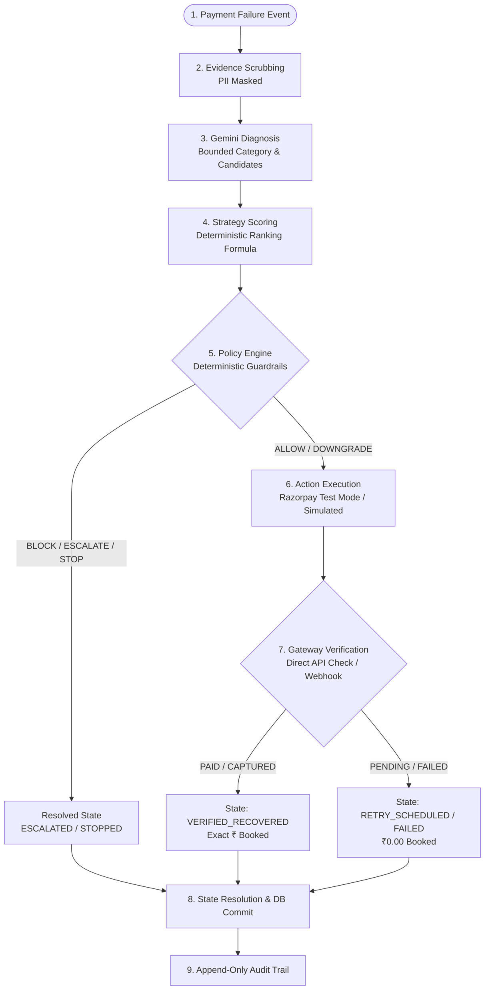
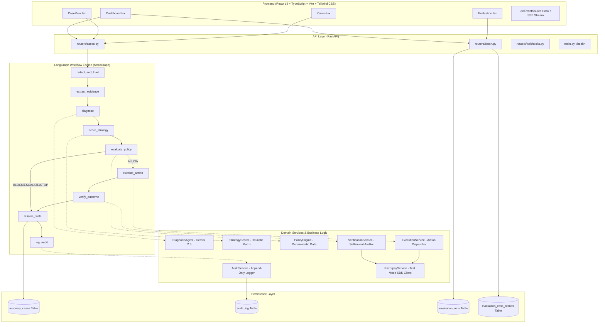

# AI Revenue Recovery Orchestrator — Architecture & Technical Specification

> **Document Type**: Code-Grounded Technical Architecture Specification  
> **Repository**: [`sreeram110909/ai-revenue-recovery-orchestrator`](file:///Users/sreerambanoth/Documents/ai-revenue-recovery-orchestrator)  
> **Buildathon Track**: Razorpay AI Buildathon — Track 03 (AI Revenue Recovery)  
> **Maturity Level**: Production-Inspired Student Buildathon Prototype  
> **Primary Source of Truth**: Repository Source Code (`backend/`, `src/`, `data/`, `tests/`)

---

## 1. Executive Summary

| Attribute | Specification |
| :--- | :--- |
| **Project Name** | **AI Revenue Recovery Orchestrator** |
| **Buildathon Track** | Track 03: AI Revenue Recovery |
| **One-Sentence Problem** | Digital merchants lose 5–15% of top-line revenue to failed one-time payments and recurring subscription billing drops due to dumb, blunt retry loops and manual operational bottlenecks. |
| **One-Sentence Solution** | A bounded AI-orchestrated, policy-governed recovery engine that pairs LLM failure diagnosis and deterministic strategy scoring with strict, hardcoded merchant policy guardrails, test-mode execution, and independent gateway reconciliation. |
| **Target User** | Merchant Engineering, Finance Operations, and Risk & Recovery teams managing high-volume payment processing on Razorpay. |
| **Core Architecture** | Stateful LangGraph workflow engine (`StateGraph`) executing a 9-node state machine with strict separation of concerns: **Evidence Sanitization $\to$ Gemini Diagnosis $\to$ Deterministic Scoring $\to$ Policy Engine Authorization $\to$ Action Execution $\to$ Gateway Verification $\to$ State Resolution $\to$ Append-Only Audit Logging**. |
| **Key Differentiator** | **Zero Blind Trust in LLM Outputs**: AI proposes candidate strategies, but a 100% deterministic Policy Engine holds unilateral veto power over financial execution, preventing infinite loops, compliance breaches, and unauthorized debits. |
| **Current Maturity Level** | **Production-Inspired Student Buildathon Prototype**. It is designed with production-grade architectural boundaries (immutable audit logs, fail-closed policy gates, PII scrubbing, idempotency tokens), but runs on local SQLite/PostgreSQL, mockable Razorpay Test Mode keys, and synthetic deterministic benchmark datasets. |
| **Major Limitations** | Does not execute real-world production money movement (runs strictly in Razorpay Test Mode / Synthetic Evaluation); does not implement autonomous customer re-engagement over WhatsApp/SMS (generates hosted payment links and update links); does not train custom ML models (uses prompt-engineered Gemini 2.5 Flash with deterministic fallback). |

---

## 2. The Problem

Failed payments represent silent revenue leakage in modern e-commerce and SaaS ecosystems. The root causes of failure are heterogeneous, but standard recovery tools treat them with blunt, one-size-fits-all cron jobs:

1. **Retry Fatigue & Card Network Penalties**: Blindly retrying cards that failed due to stolen cards, closed accounts, or expired mandates triggers card network velocity limits and gateway risk blocks.
2. **Customer Friction**: Forcing a customer whose bank timed out to manually re-enter their entire 16-digit card details introduces unnecessary abandonment when a delayed background retry would have seamlessly succeeded.
3. **Mandate & Subscription Brittleness**: Recurring e-mandates fail when cards expire or RBI Additional Factor of Authentication (AFA) limits are hit, requiring targeted mandate-update links rather than repeated auto-debits.
4. **Fragmented Workflows**: Merchant support teams manually triage high-value failures across disparate spreadsheets, dashboards, and gateway logs without an immutable audit trail.

### Exact Failure Categories Supported by the Codebase
As verified in [`backend/app/schemas/enums.py`](file:///Users/sreerambanoth/Documents/ai-revenue-recovery-orchestrator/backend/app/schemas/enums.py#L16-L23), the system classifies every payment failure into one of exactly 7 discrete failure categories:

```python
class FailureCategory(str, Enum):
    INSUFFICIENT_FUNDS = "INSUFFICIENT_FUNDS"
    EXPIRED_INSTRUMENT = "EXPIRED_INSTRUMENT"
    BANK_TIMEOUT_NETWORK = "BANK_TIMEOUT_NETWORK"
    AUTHENTICATION_OTP_FAILURE = "AUTHENTICATION_OTP_FAILURE"
    RISK_SECURITY_BLOCK = "RISK_SECURITY_BLOCK"
    MANDATE_EXPIRED_INVALID = "MANDATE_EXPIRED_INVALID"
    GENERAL_TECHNICAL_ERROR = "GENERAL_TECHNICAL_ERROR"
```

---

## 3. The Exact Problem We Solve

### What We Solve (`IMPLEMENTED` & `AUTOMATED VERIFIED`)
- **Heterogeneous One-Time Failure Triage**: Distinguishing transient infrastructure timeouts (which should be retried) from expired cards (which require hosted payment links) and security blocks (which must be escalated to humans).
- **Compliant Subscription Lifecycle Recovery**: Distinguishing transient balance issues on active mandates from expired/revoked mandates that require customer-facing mandate-update workflows.
- **Fail-Closed Merchant Policy Enforcement**: Deterministic guardrails that enforce retry caps, cooldown windows, maximum automated amount limits (default ₹15,000 ceiling), and mandate integrity checks before any gateway dispatch.
- **Independent Gateway Truth & Double-Counting Protection**: Requiring explicit payment gateway verification (`status="captured"` or `"paid"`) before booking recovered revenue to prevent false reporting.
- **Idempotent Auditability**: Generating a tamper-evident, append-only chronological log of every model proposal, policy decision, gateway response, and status mutation.

### What We Do NOT Claim to Solve (`EXPLICIT SCOPE LIMITS`)
- **Not an Unrestricted Autonomous Financial Agent**: The AI cannot move funds, modify customer balances, alter credit limits, or override merchant risk policies.
- **Not a Production Payment Gateway**: The platform is an orchestration and decisioning overlay sitting on top of Razorpay APIs; it is not a licensed payment aggregator or bank switch.
- **Not a 100% Guaranteed Recovery Engine**: Recovery rates depend fundamentally on customer liquidity and bank infrastructure availability; our benchmark measures a verified **53.3% case recovery rate** (32/60 cases) on a canonical synthetic dataset.
- **Not a Replacement for Human Operations**: High-value transactions (> ₹15,000) and suspicious fraud blocks (`RISK_SECURITY_BLOCK`) are explicitly routed to human review queues.

---

## 4. The Solution: High-Level Paradigm

The architecture enforces a strict four-stage decision paradigm:

```
[ AI Proposes ] ──► [ Policy Decides ] ──► [ Gateway Executes ] ──► [ Verification Confirms ]
```

### End-to-End Decision Loop


---

## 5. Why AI Is Used

AI (specifically Google Gemini 2.5 Flash) is integrated into **Diagnosis and Contextual Root-Cause Interpretation**, where deterministic rule engines struggle with unstructured error strings and multi-variable context:

1. **Unstructured Gateway Error Interpretation**: Gateway raw error messages vary wildly across acquiring banks (e.g. `"U19 - Bank internal failure"`, `"Issuer bank did not respond within 30000ms"`, `"Risk score 88 exceeds merchant velocity profile"`). Gemini normalizes messy error descriptions into structured root-cause classifications.
2. **Contextual Strategy Proposing**: Proposing candidate recovery sequences based on payment metadata (customer segment, failure reason, historical attempt count).

### AI Boundary & Failure Defense
- **Input to Model**: Strictly scrubbed JSON containing `case_type`, `amount`, `currency`, `failure_code`, `failure_description`, `customer_segment`, `attempts_count`, and masked identifiers.
- **Output Schema**: Rigid JSON object containing `diagnosis`, `failure_category`, `candidate_strategies`, `rationale`, and `confidence`.
- **Validation**: Bounded Pydantic validator [`backend/app/schemas/diagnosis.py`](file:///Users/sreerambanoth/Documents/ai-revenue-recovery-orchestrator/backend/app/schemas/diagnosis.py) validates that `failure_category` is a valid enum and all `candidate_strategies` belong strictly to the locked action space for that workflow.
- **Deterministic Fallback**: If Gemini fails, times out, returns malformed JSON, or leaks unapproved strategies, [`DiagnosisAgent._fallback_diagnosis()`](file:///Users/sreerambanoth/Documents/ai-revenue-recovery-orchestrator/backend/app/agents/diagnosis.py#L298-L336) automatically intercepts the failure and applies deterministic failure-to-strategy mapping rules with zero interruption.

---

## 6. Why AI Is Not Used Everywhere

In financial systems, non-deterministic generative models represent severe liability risks if granted execution or policy authority. The orchestrator explicitly restricts AI from the following layers:

```
┌────────────────────────────────────────────────────────────────────────┐
│                        WHERE AI IS FORBIDDEN                           │
├────────────────────────────────┬───────────────────────────────────────┤
│ Financial Limits & Amounts     │ 100% Deterministic Policy Engine      │
├────────────────────────────────┼───────────────────────────────────────┤
│ Retry Count Limits & Cooldowns │ 100% Deterministic Rule POL-04/POL-05  │
├────────────────────────────────┼───────────────────────────────────────┤
│ Final Execution Authorization  │ 100% Deterministic Policy CheckResult │
├────────────────────────────────┼───────────────────────────────────────┤
│ Settlement & Recovered Revenue │ 100% Payment Gateway Truth (Razorpay) │
├────────────────────────────────┼───────────────────────────────────────┤
│ Audit Trail Ingestion          │ Immutable Append-Only Database Model  │
└────────────────────────────────┴───────────────────────────────────────┘
```

> **Core Engineering Tenet**: *"Trust comes from system architecture, not from blindly trusting the model."*

---

## 7. Full System Architecture

### Component Hierarchy


---

## 8. Complete Tech Stack

| Layer | Technology | Version | Purpose in Codebase | Repository Location |
| :--- | :--- | :--- | :--- | :--- |
| **Backend Framework** | FastAPI | `>=0.115.0` | Async REST API routes, Pydantic request validation, dependency injection, and SSE streaming. | [`backend/app/main.py`](file:///Users/sreerambanoth/Documents/ai-revenue-recovery-orchestrator/backend/app/main.py) |
| **ASGI Server** | Uvicorn | `>=0.30.0` | High-performance asynchronous HTTP server with hot-reloading support. | [`requirements.txt`](file:///Users/sreerambanoth/Documents/ai-revenue-recovery-orchestrator/requirements.txt) |
| **Workflow Engine** | LangGraph | `>=0.2.0` | Stateful cyclical multi-agent graph orchestration with `StateGraph` and checkpointing. | [`backend/app/orchestrator/builder.py`](file:///Users/sreerambanoth/Documents/ai-revenue-recovery-orchestrator/backend/app/orchestrator/builder.py) |
| **LLM SDK** | Google GenAI SDK | `>=0.1.0` | Official client library for Gemini 2.5 Flash structured output generation. | [`backend/app/agents/diagnosis.py`](file:///Users/sreerambanoth/Documents/ai-revenue-recovery-orchestrator/backend/app/agents/diagnosis.py) |
| **Payments SDK** | Razorpay Python | `>=1.4.1` | Official Razorpay client for creating payment links and fetching transaction statuses in Test Mode. | [`backend/app/services/razorpay_service.py`](file:///Users/sreerambanoth/Documents/ai-revenue-recovery-orchestrator/backend/app/services/razorpay_service.py) |
| **ORM & Database** | SQLAlchemy | `>=2.0.30` | Data modeling and session management; auto-switches between SQLite and PostgreSQL. | [`backend/app/database.py`](file:///Users/sreerambanoth/Documents/ai-revenue-recovery-orchestrator/backend/app/database.py) |
| **Schema Validation** | Pydantic | `>=2.8.0` | Strict data validation, immutability constraints, and JSON serialization. | [`backend/app/schemas/`](file:///Users/sreerambanoth/Documents/ai-revenue-recovery-orchestrator/backend/app/schemas) |
| **Backend Testing** | Pytest | `>=8.3.0` | Comprehensive unit, safety, policy, and integration test suite (125 tests). | [`backend/tests/`](file:///Users/sreerambanoth/Documents/ai-revenue-recovery-orchestrator/backend/tests) |
| **Frontend Framework** | React | `^19.0.1` | Declarative user interface for dashboard, cases list, case detail, and benchmark views. | [`src/App.tsx`](file:///Users/sreerambanoth/Documents/ai-revenue-recovery-orchestrator/src/App.tsx) |
| **Frontend Language** | TypeScript | `~5.8.2` | Static typing and API response contract enforcement. | [`src/types/api.ts`](file:///Users/sreerambanoth/Documents/ai-revenue-recovery-orchestrator/src/types/api.ts) |
| **Build Tool** | Vite | `^6.2.3` | High-speed frontend bundling and local HMR dev server. | [`vite.config.ts`](file:///Users/sreerambanoth/Documents/ai-revenue-recovery-orchestrator/vite.config.ts) |
| **Styling** | Tailwind CSS + CVA | `^4.1.14` | Modern slate-themed design system with Class Variance Authority badges. | [`src/index.css`](file:///Users/sreerambanoth/Documents/ai-revenue-recovery-orchestrator/src/index.css) |
| **Icons** | Lucide React | `^0.546.0` | Consistent UI iconography across navigation and status indicators. | [`src/components/`](file:///Users/sreerambanoth/Documents/ai-revenue-recovery-orchestrator/src/components) |

---

## 9. Repository Structure

```
ai-revenue-recovery-orchestrator/
├── backend/
│   ├── app/
│   │   ├── agents/               # Bounded reasoning & scoring agents
│   │   │   ├── evidence.py       # PII scrubbing & evidence validation
│   │   │   ├── diagnosis.py      # Bounded Gemini agent + fallback rules
│   │   │   └── strategy_scorer.py# Deterministic signal-weighted ranking
│   │   ├── eval/                 # Synthetic benchmark engine & metrics
│   │   │   ├── artifacts.py      # Benchmark JSON/Markdown report exporter
│   │   │   ├── metrics.py        # Accounting & policy violation detector
│   │   │   ├── runner.py         # 3-way benchmark runner (No Action, Retry, Orch)
│   │   │   └── synthetic_dataset.py # Deterministic synthetic case generator
│   │   ├── models/               # SQLAlchemy ORM relational models
│   │   │   ├── case_model.py     # recovery_cases table definition
│   │   │   ├── audit_model.py    # audit_log table definition
│   │   │   └── evaluation_model.py # evaluation_runs & results tables
│   │   ├── orchestrator/         # LangGraph workflow engine
│   │   │   ├── builder.py        # StateGraph constructor & edge routers
│   │   │   ├── nodes.py          # 9 discrete LangGraph workflow node functions
│   │   │   ├── state.py          # RecoveryWorkflowState TypedDict
│   │   │   └── workflow.py       # run_recovery_workflow runner
│   │   ├── policies/             # Deterministic Merchant Policy Engine
│   │   │   └── engine.py         # 6 hardcoded safety guardrails (POL-01 to POL-06)
│   │   ├── repositories/         # Data Access Layer (CRUD per model)
│   │   │   ├── case_repository.py
│   │   │   ├── audit_repository.py
│   │   │   └── evaluation_repository.py
│   │   ├── routers/              # FastAPI HTTP route handlers
│   │   │   ├── cases.py          # /cases CRUD, /process, /process/stream
│   │   │   ├── batch.py          # /api/v1/batch/run, /metrics/batch
│   │   │   └── webhooks.py       # /api/v1/webhooks/razorpay (HMAC verified)
│   │   ├── schemas/              # Pydantic data schemas & enums
│   │   │   ├── enums.py          # Domain enums (Status, Category, Strategy, etc.)
│   │   │   ├── case.py           # RecoveryCase schema & sub-models
│   │   │   ├── diagnosis.py      # DiagnosisResult & StrategyScore schemas
│   │   │   ├── policy.py         # PolicyCheckResult & RuleEvaluationDetail
│   │   │   └── evaluation.py     # BatchMetrics & Comparison schemas
│   │   ├── services/             # Core business & infrastructure services
│   │   │   ├── audit_service.py  # Append-only audit logger
│   │   │   ├── execution_service.py # Policy-approved action dispatcher
│   │   │   ├── verification_service.py # Gateway settlement auditor
│   │   │   ├── razorpay_service.py # Razorpay Test Mode SDK wrapper
│   │   │   └── seed_service.py   # Automatic idempotent startup dataset seeder
│   │   ├── config.py             # Pydantic Settings & environment loader
│   │   ├── database.py           # Engine initialization & session factory
│   │   └── main.py               # FastAPI entry point & lifespan manager
│   └── tests/                    # 125 Pytest unit and integration tests
├── data/
│   └── evaluations/datasets/     # Canonical 60-case synthetic dataset (seed=42)
├── src/                          # React Frontend Application
│   ├── components/               # StatusBadge, DecisionTimeline, PolicyPanel, etc.
│   ├── hooks/                    # useEventSource.ts (SSE streaming)
│   ├── pages/                    # Dashboard.tsx, Cases.tsx, CaseView.tsx, Evaluation.tsx
│   ├── services/                 # api.ts (Fetch API client)
│   └── types/                    # api.ts (TypeScript interface contracts)
└── docs/                         # Comprehensive engineering documentation
```

---

## 10. Data Model

### `recovery_cases` (Mapped via [`RecoveryCaseModel`](file:///Users/sreerambanoth/Documents/ai-revenue-recovery-orchestrator/backend/app/models/case_model.py))
| Column | Type | Nullable | Description |
| :--- | :--- | :---: | :--- |
| `id` | `String(64)` | No | Primary Key (e.g. `case_api_001`, `synth_v1.0_42_010`). |
| `case_type` | `String(32)` | No | `ONE_TIME_PAYMENT` or `SUBSCRIPTION_RECURRING`. |
| `customer_id` | `String(64)` | No | Anonymized merchant customer identifier. |
| `masked_customer_email` | `String(256)` | No | Redacted email (e.g. `us***@outlook.com`). |
| `masked_customer_phone` | `String(32)` | No | Redacted phone number (e.g. `+91 98*** **181`). |
| `customer_segment` | `String(32)` | Yes | `STANDARD`, `VIP`, `ENTERPRISE`, etc. |
| `amount` | `Float` | No | Total transaction amount at risk in major units. |
| `currency` | `String(8)` | No | `INR`, `USD`, etc. (Default: `INR`). |
| `gateway_reference_id` | `String(128)` | No | Original failed gateway order/payment reference. |
| `failure_code` | `String(128)` | No | Raw failure code from payment gateway. |
| `failure_description` | `Text` | No | Raw failure narrative. |
| `failure_category` | `String(48)` | No | Canonical FailureCategory enum string. |
| `attempts_count` | `Integer` | No | Number of prior recovery attempts already made. |
| `max_attempts_allowed` | `Integer` | No | Maximum permitted recovery attempts (default: 3). |
| `last_attempt_at` | `DateTime` | Yes | Timestamp of most recent recovery dispatch. |
| `subscription_details` | `JSON` | Yes | Serialized [`SubscriptionMetadata`](file:///Users/sreerambanoth/Documents/ai-revenue-recovery-orchestrator/backend/app/schemas/case.py#L10-L16) (plan, interval, mandate status). |
| `current_status` | `String(32)` | No | Current lifecycle state ([`CaseStatus`](file:///Users/sreerambanoth/Documents/ai-revenue-recovery-orchestrator/backend/app/schemas/enums.py#L40-L50)). |
| `recommended_strategy` | `String(32)` | Yes | Top strategy ranked by AI/scorer. |
| `strategy_confidence` | `Float` | Yes | Calculated confidence score between 0.0 and 1.0. |
| `strategy_rationale` | `Text` | Yes | Diagnostic narrative explaining strategy choice. |
| `policy_evaluation` | `JSON` | Yes | Serialized [`PolicyCheckResult`](file:///Users/sreerambanoth/Documents/ai-revenue-recovery-orchestrator/backend/app/schemas/policy.py) snapshot. |
| `executed_action` | `JSON` | Yes | Serialized [`ActionExecutionRecord`](file:///Users/sreerambanoth/Documents/ai-revenue-recovery-orchestrator/backend/app/schemas/case.py#L19-L29). |
| `verification_outcome` | `JSON` | Yes | Serialized [`VerificationRecord`](file:///Users/sreerambanoth/Documents/ai-revenue-recovery-orchestrator/backend/app/schemas/case.py#L31-L39). |
| `verified_recovered_amount`| `Float` | No | Exact amount independently verified as settled. |
| `is_escalated` | `Boolean` | No | Flag indicating routing to human review queue. |
| `escalation_reason` | `Text` | Yes | Diagnostic explanation for human escalation. |
| `provenance` | `String(32)` | No | `LIVE_TEST_MODE_API_RESULT`, `MOCKED_TEST_RESULT`, `SYNTHETIC_DATA_RESULT`. |
| `created_at` / `updated_at`| `DateTime` | No | UTC timestamps. |

### `audit_log` (Mapped via [`AuditLogModel`](file:///Users/sreerambanoth/Documents/ai-revenue-recovery-orchestrator/backend/app/models/audit_model.py))
- **`id`**: Unique audit ID (`audit_<hex12>`).
- **`case_id`**: Foreign Key referencing `recovery_cases.id`.
- **`event_type`**: String tag of transition (e.g. `CASE_INGESTED`, `POLICY_EVALUATION`).
- **`event_timestamp`**: UTC timestamp of event recording.
- **`actor`**: `SYSTEM`, `DIAGNOSIS_AGENT`, `POLICY_ENGINE`, `EXECUTION_SERVICE`, `GATEWAY_VERIFICATION`, `WEBHOOK`.
- **`previous_status`** / **`new_status`**: Case status transition pair.
- **`policy_outcome`**: `ALLOW`, `BLOCK`, `DOWNGRADE`, `ESCALATE`, `STOP`.
- **`strategy`**: Target strategy associated with the event.
- **`details`**: Arbitrary JSON payload capturing transition context (scores, reasons, API payloads).
- **`provenance`**: Data source classification.

---

## 11. Backend Startup and Idempotent Seeding

### History & Root Cause
Prior to the seeding redesign, running the backend on a fresh clone initialized empty SQL tables. The 60-case canonical dataset only existed in an offline benchmark runner, causing `GET /api/v1/cases/synth_v1.0_42_010` to return `404 Not Found` for any browsing user.

### Current Implementation (`AUTOMATED VERIFIED`)
On startup, [`backend/app/main.py`](file:///Users/sreerambanoth/Documents/ai-revenue-recovery-orchestrator/backend/app/main.py#L46-L58) calls [`seed_initial_cases_if_needed(session)`](file:///Users/sreerambanoth/Documents/ai-revenue-recovery-orchestrator/backend/app/services/seed_service.py):
1. **Case Existence Check**: Queries `RecoveryCaseModel` for each of the **62 canonical cases** (2 named demo cases: `case_api_001` & `case_api_002` + 60 benchmark cases `synth_v1.0_42_001` through `synth_v1.0_42_060`).
2. **Strict Idempotency**: If a case ID already exists in the database, it is **skipped**.
3. **State Preservation**: If a user runs `case_api_001` through the LangGraph workflow (mutating its status to `RETRY_SCHEDULED`), subsequent server restarts or `--reload` triggers **preserve the processed status and audit history intact**, without resetting it to `DETECTED`.
4. **Single Ingestion Event**: Exactly one `CASE_INGESTED` audit event is written upon initial insertion.

---

## 12. API Inventory

| Method | Endpoint | Purpose | Input Payload | Output Payload | Side Effects | UI Consumer |
| :--- | :--- | :--- | :--- | :--- | :--- | :--- |
| `GET` | `/health` | Health & capability check. | None | `{"status": "healthy", "database": "...", "razorpay_configured": bool, ...}` | None | Nav Header / System Status |
| `GET` | `/api/v1/cases` | List cases with optional filters. | Query: `status`, `case_type`, `limit`, `offset` | `{"total": int, "cases": RecoveryCase[]}` | None | [`Cases.tsx`](file:///Users/sreerambanoth/Documents/ai-revenue-recovery-orchestrator/src/pages/Cases.tsx) |
| `GET` | `/api/v1/cases/{id}` | Case detail + full audit trail. | Path: `id` | `{"case": RecoveryCase, "audit_trail": AuditLog[]}` | None | [`CaseView.tsx`](file:///Users/sreerambanoth/Documents/ai-revenue-recovery-orchestrator/src/pages/CaseView.tsx) |
| `POST` | `/api/v1/cases/ingest` | Ingest new payment failure cases. | `{"cases": RecoveryCase[]}` | `{"ingested_count": int, "case_ids": str[]}` | Inserts cases & `CASE_INGESTED` audit logs. | External ERP / Ingestion API |
| `POST` | `/api/v1/cases/{id}/process` | Execute synchronous LangGraph recovery workflow. | Path: `id` | `{"status": "success", "final_status": str, "case": RecoveryCase, ...}` | Executes full LangGraph graph; mutates case state & audit trail. | `CaseView.tsx` ("Process" button) |
| `GET` | `/api/v1/cases/{id}/process/stream` | Real-time Server-Sent Events (SSE) streaming execution. | Path: `id` | SSE event stream emitting 10 discrete step updates. | Executes LangGraph workflow node-by-node; updates database. | `CaseView.tsx` (Live Progress Modal) |
| `POST` | `/api/v1/batch/run` | Run 3-way synthetic benchmark. | `{"seed": int, "count": int, "dataset_version": str}` | [`BatchRunSummary`](file:///Users/sreerambanoth/Documents/ai-revenue-recovery-orchestrator/backend/app/schemas/evaluation.py) JSON | Writes `evaluation_runs` and `evaluation_case_results` records. | [`Evaluation.tsx`](file:///Users/sreerambanoth/Documents/ai-revenue-recovery-orchestrator/src/pages/Evaluation.tsx) |
| `GET` | `/api/v1/metrics/batch` | Fetch latest or specific benchmark summary. | Query: `batch_id` (optional) | [`BatchRunSummary`](file:///Users/sreerambanoth/Documents/ai-revenue-recovery-orchestrator/backend/app/schemas/evaluation.py) JSON | Generates default run if DB is empty. | [`Dashboard.tsx`](file:///Users/sreerambanoth/Documents/ai-revenue-recovery-orchestrator/src/pages/Dashboard.tsx) |
| `POST` | `/api/v1/webhooks/razorpay` | Ingest Razorpay webhooks (`payment_link.paid`, `payment.captured`). | Razorpay webhook body + `X-Razorpay-Signature` header | `{"status": "processed", "event_id": str, "case_id": str}` | Verifies HMAC signature, deduplicates `event_id`, settles case to `VERIFIED_RECOVERED`. | Razorpay Webhook Gateway |

---

## 13. Case Lifecycle

```
[ Ingested ] ──► [ DETECTED ] ──► [ DIAGNOSED ] ──► [ POLICY_EVALUATED ]
                                                           │
             ┌─────────────────────────────────────────────┴──────────────────────────────┐
             ▼                                                                            ▼
     [ Policy: ALLOW ]                                                          [ Policy: BLOCK/STOP/ESCALATE ]
             │                                                                            │
             ▼                                                                            ▼
  [ ACTION_IN_PROGRESS ]                                                        [ STOPPED / ESCALATED ]
             │                                                                            │
             ▼                                                                            ▼
   [ ACTION_COMPLETED ]                                                             (Terminal)
             │
      ┌──────┴────────────────────────┐
      ▼                               ▼
[ Gateway: PAID ]            [ Gateway: PENDING/FAILED ]
      │                               │
      ▼                               ▼
[ VERIFIED_RECOVERED ]       [ RETRY_SCHEDULED / FAILED ]
```

---

## 14. LangGraph / Orchestrator Architecture

The core workflow is implemented as a compiled LangGraph `StateGraph` in [`backend/app/orchestrator/builder.py`](file:///Users/sreerambanoth/Documents/ai-revenue-recovery-orchestrator/backend/app/orchestrator/builder.py).

### Internal StateGraph Nodes vs. Product-Facing UI Stages
- **Product-Facing UI (7 Stages)**: The frontend decision timeline groups user-relevant operations into:
  1. `detect_and_load` (Ingestion & Detection)
  2. `extract_evidence` (Evidence Scrubbing)
  3. `diagnose` (Gemini Diagnosis)
  4. `score_strategy` (Strategy Scoring)
  5. `evaluate_policy` (Policy Engine Evaluation)
  6. `execute_action` (Action Dispatch)
  7. `verify_outcome` (Gateway Verification)
- **Internal Backend Graph (9 Nodes)**: The compiled StateGraph includes two additional internal lifecycle nodes:
  8. `resolve_state`: Resolves terminal status overrides (e.g. policy-mandated stops/escalations) and commits the case to the repository.
  9. `log_audit`: Synchronizes final audit events before reaching `END`.

### Conditional Routers
- **`route_after_evidence`**: If the case is already in a terminal state (`VERIFIED_RECOVERED`, `ESCALATED`, `STOPPED`, `CLOSED_UNRECOVERABLE`), immediately bypasses the pipeline directly to `resolve_state`.
- **`route_after_policy`**: Permits transition to `execute_action` **only** if policy outcome is `ALLOW` or `DOWNGRADE` AND the approved strategy is an automated action. All `BLOCK`, `ESCALATE`, and `STOP` decisions bypass execution directly to `resolve_state`.
- **`route_after_execution`**: If action execution succeeds, transitions to `verify_outcome`; if execution fails, transitions to `resolve_state`.

---

## 15. AI / LLM Implementation

### Model & Configuration
- **Model**: `gemini-2.5-flash` (via official `google-genai` SDK).
- **Temperature**: `0.1` (enforcing deterministic, low-variance categorization).
- **Max Output Tokens**: `1024`.
- **Response Format**: `application/json`.

### Prompt Design & System Boundary
The system prompt strictly bounds the LLM's operational scope:
```text
You are a payment failure diagnosis assistant for the AI Revenue Recovery Orchestrator.
Your role is STRICTLY LIMITED to analyzing payment failure evidence and providing a structured diagnosis.
You must NOT:
- Execute any financial actions
- Authorize payments or retries
- Modify policy rules or retry limits
- Override escalation or stopping decisions
- Declare revenue as recovered
- Access or request any API keys, secrets, or credentials
```

### Deterministic Fallback Rules
If the Gemini API key is unset or an API call fails/times out, [`DiagnosisAgent._fallback_diagnosis()`](file:///Users/sreerambanoth/Documents/ai-revenue-recovery-orchestrator/backend/app/agents/diagnosis.py#L298-L336) applies hardcoded fallback mappings. Each returned `DiagnosisResult` sets `is_fallback: True/False`, providing transparent provenance.

---

## 16. LLM Evaluation vs. Orchestrator Evaluation

> [!IMPORTANT]
> **Evaluation Scope Distinction**:
> - **Orchestrator / Business Evaluation (`IMPLEMENTED` & `AUTOMATED VERIFIED`)**: The batch benchmark evaluates **system-level financial metrics**: verified recovered revenue (₹), revenue recovery rate (%), case recovery rate (%), recovery attempts, successful dispatches, policy blocks, human escalations, and policy violations across 3 comparative strategies.
> - **LLM Diagnostic Accuracy (`NOT IMPLEMENTED AS A NUMERIC BENCHMARK`)**: The repository does **not** compute a distinct standalone LLM token accuracy or F1-score metric. The benchmark evaluates end-to-end recovery effectiveness and policy safety under deterministic inputs.

---

## 17. Strategy Scoring

Candidate recovery actions are ranked using an inspectable, linear signal-weighting formula in [`StrategyScorer`](file:///Users/sreerambanoth/Documents/ai-revenue-recovery-orchestrator/backend/app/agents/strategy_scorer.py):

$$\text{Score}(\text{strategy}) = \text{BaseScore} + W_{\text{failure\_category}} + W_{\text{attempt\_exhaustion}} + W_{\text{amount\_tier}} + W_{\text{diagnosis\_boost}}$$

### Base Scores
- `SMART_RETRY` / `SUBSCRIPTION_RETRY`: `70.0`
- `PAYMENT_LINK` / `UPDATE_PAYMENT_METHOD`: `40.0`
- `HUMAN_ESCALATION`: `20.0`
- `STOP`: `10.0`

### Real Example: Bank Timeout vs. Expired Instrument
- **Bank Timeout Network**: Boosts `SMART_RETRY` by $+20.0$ (Score: $90.0$), penalizes `HUMAN_ESCALATION` by $-10.0$.
- **Expired Instrument**: Penalizes `SMART_RETRY` by $-40.0$ (Score: $30.0$), boosts `PAYMENT_LINK` by $+25.0$ (Score: $65.0$).

---

## 18. Policy Engine

The Policy Engine ([`backend/app/policies/engine.py`](file:///Users/sreerambanoth/Documents/ai-revenue-recovery-orchestrator/backend/app/policies/engine.py)) is 100% deterministic with zero network dependencies.

| Rule ID | Rule Name | Condition | Decision | Safety Purpose |
| :--- | :--- | :--- | :---: | :--- |
| `POL-01-STATUS-FREEZE` | Case Status Freeze | Case status is `VERIFIED_RECOVERED`, `ESCALATED`, `STOPPED`, or `CLOSED_UNRECOVERABLE`. | **`STOP`** | Prevents re-running terminal or completed cases. |
| `POL-02-AMOUNT-CEILING` | Automated Value Ceiling | Transaction amount $> \text{₹}15,000.00$. | **`ESCALATE`** | Mitigates automated financial exposure on high-ticket transactions. |
| `POL-03-NON-RETRYABLE` | Non-Retryable Root Cause | Failure category is `RISK_SECURITY_BLOCK`, `EXPIRED_INSTRUMENT`, or `MANDATE_EXPIRED_INVALID` and proposed action is a retry. | **`BLOCK` / `DOWNGRADE`** | Prevents retry storms against instruments that cannot succeed. |
| `POL-04-RETRY-CAP` | Maximum Attempt Limit | Attempt count $\ge 3$. | **`DOWNGRADE` / `ESCALATE`** | Prevents retry fatigue and customer harassment. |
| `POL-05-RETRY-COOLDOWN` | Mandatory Cooldown Window| Elapsed time since last attempt $< 4.0\text{ hours}$. | **`BLOCK`** | Enforces spacing between retry calls. |
| `POL-06-MANDATE-INTEGRITY`| Mandate Status Guardrail | Recurring mandate is `EXPIRED`, `REVOKED`, or `INVALID` and proposed action is `SUBSCRIPTION_RETRY`. | **`DOWNGRADE`** | Downgrades auto-debit to customer-facing `UPDATE_PAYMENT_METHOD`. |

### Real Override Example (Trace from Canonical Benchmark)
- **Case**: `synth_v1.0_42_059` (Subscription failure, Amount: **₹31,415.20**).
- **AI Recommendation**: `SUBSCRIPTION_RETRY`.
- **Policy Engine Evaluation**: Triggered `POL-02-AMOUNT-CEILING` (₹31,415.20 exceeds ₹15,000 ceiling).
- **Final Decision**: Overridden to **`ESCALATE`** (Routed to Operations Queue, zero automated debit attempted).

---

## 19. Execution Layer

Implemented in [`ExecutionService`](file:///Users/sreerambanoth/Documents/ai-revenue-recovery-orchestrator/backend/app/services/execution_service.py):
- **Mandatory Policy Check**: Validates `policy_result.passed == True` prior to dispatching any action.
- **Idempotency Protection**: Generates unique `action_id` (`act_<uuid12>`); if the case already has a successful execution record, re-execution is rejected.
- **Action Execution $\ne$ Payment Recovered**: Executing an action (e.g. creating a payment link with status `SUCCESS`) transitions the case to `ACTION_COMPLETED`, but **recovered revenue remains ₹0.00** until independent verification settles the transaction.

---

## 20. Verification / Reconciliation

Implemented in [`VerificationService`](file:///Users/sreerambanoth/Documents/ai-revenue-recovery-orchestrator/backend/app/services/verification_service.py):
- **Independent Gateway Truth**: Queries the payment gateway directly (`fetch_payment` / `fetch_payment_link`) or parses signed webhooks.
- **Strict Accounting Rule**:
  - If gateway status is `"paid"` or `"captured"` $\to$ Case status transitions to `VERIFIED_RECOVERED`, `verified_recovered_amount = amount`.
  - If gateway status is `"pending"`, `"created"`, or `"failed"` $\to$ `verified_recovered_amount = 0.00`.
- **Double-Counting Protection**: If a case is already `VERIFIED_RECOVERED`, subsequent verification calls return the established record without inflating metrics.

---

## 21. Webhook System

Implemented in [`backend/app/routers/webhooks.py`](file:///Users/sreerambanoth/Documents/ai-revenue-recovery-orchestrator/backend/app/routers/webhooks.py):
1. **Cryptographic Signature Verification**: Validates incoming `X-Razorpay-Signature` against `RAZORPAY_WEBHOOK_SECRET` using HMAC-SHA256.
2. **Event-Level Idempotency (`LIVE VERIFIED`)**: Caches processed `event_id` values in-memory; duplicate webhook deliveries are acknowledged with `200 OK` (`"duplicate_ignored"`) and produce exactly 1 audit event.
3. **Automated Settlement**: Matches incoming `payment_link.paid` or `payment.captured` events to the corresponding `RecoveryCaseModel` and marks the case as `VERIFIED_RECOVERED`.

---

## 22. Audit Log

The audit system ([`AuditService`](file:///Users/sreerambanoth/Documents/ai-revenue-recovery-orchestrator/backend/app/services/audit_service.py)) provides an immutable, append-only chronological record.

### Canonical ~10-Event Lifecycle Walk
```
1.  CASE_INGESTED           (Actor: INGESTION_API / SYSTEM)
2.  EVIDENCE_EXTRACTED      (Actor: SYSTEM)
3.  DIAGNOSIS_COMPLETED     (Actor: DIAGNOSIS_AGENT)
4.  STRATEGY_SCORED         (Actor: SYSTEM)
5.  POLICY_EVALUATION       (Actor: POLICY_ENGINE)
6.  ACTION_REQUESTED        (Actor: EXECUTION_SERVICE)
7.  POLICY_APPROVED         (Actor: POLICY_ENGINE)
8.  ACTION_DISPATCHED       (Actor: EXECUTION_SERVICE)
9.  ACTION_RESULT           (Actor: EXECUTION_SERVICE)
10. VERIFICATION_REQUESTED  (Actor: GATEWAY_VERIFICATION)
11. VERIFICATION_RECEIVED   (Actor: GATEWAY_VERIFICATION)
12. RECOVERY_CONFIRMED      (Actor: GATEWAY_VERIFICATION)
```

---

## 23. Evidence Verification Summary

| Architectural Component | Implementation Status | Evidence Level | Verification Source |
| :--- | :--- | :--- | :--- |
| **Domain Enums & Schemas** | Complete | `AUTOMATED VERIFIED` | [`backend/app/schemas/enums.py`](file:///Users/sreerambanoth/Documents/ai-revenue-recovery-orchestrator/backend/app/schemas/enums.py), [`test_models.py`](file:///Users/sreerambanoth/Documents/ai-revenue-recovery-orchestrator/backend/tests/test_models.py) |
| **Evidence PII Scrubbing** | Complete | `AUTOMATED VERIFIED` | [`evidence.py`](file:///Users/sreerambanoth/Documents/ai-revenue-recovery-orchestrator/backend/app/agents/evidence.py), [`test_evidence.py`](file:///Users/sreerambanoth/Documents/ai-revenue-recovery-orchestrator/backend/tests/test_evidence.py) |
| **Gemini Diagnosis + Fallback**| Complete | `AUTOMATED VERIFIED` | [`diagnosis.py`](file:///Users/sreerambanoth/Documents/ai-revenue-recovery-orchestrator/backend/app/agents/diagnosis.py), [`test_diagnosis_agent.py`](file:///Users/sreerambanoth/Documents/ai-revenue-recovery-orchestrator/backend/tests/test_diagnosis_agent.py) |
| **Deterministic Strategy Scorer**| Complete | `AUTOMATED VERIFIED` | [`strategy_scorer.py`](file:///Users/sreerambanoth/Documents/ai-revenue-recovery-orchestrator/backend/app/agents/strategy_scorer.py), [`test_strategy_scorer.py`](file:///Users/sreerambanoth/Documents/ai-revenue-recovery-orchestrator/backend/tests/test_strategy_scorer.py) |
| **Policy Engine Guardrails** | Complete | `AUTOMATED VERIFIED` | [`policies/engine.py`](file:///Users/sreerambanoth/Documents/ai-revenue-recovery-orchestrator/backend/app/policies/engine.py), [`test_policy_engine.py`](file:///Users/sreerambanoth/Documents/ai-revenue-recovery-orchestrator/backend/tests/test_policy_engine.py) |
| **LangGraph 9-Node StateGraph**| Complete | `AUTOMATED VERIFIED` | [`orchestrator/builder.py`](file:///Users/sreerambanoth/Documents/ai-revenue-recovery-orchestrator/backend/app/orchestrator/builder.py), [`test_orchestrator.py`](file:///Users/sreerambanoth/Documents/ai-revenue-recovery-orchestrator/backend/tests/test_orchestrator.py) |
| **Action Execution Layer** | Complete | `AUTOMATED VERIFIED` | [`execution_service.py`](file:///Users/sreerambanoth/Documents/ai-revenue-recovery-orchestrator/backend/app/services/execution_service.py), [`test_execution_service.py`](file:///Users/sreerambanoth/Documents/ai-revenue-recovery-orchestrator/backend/tests/test_execution_service.py) |
| **Independent Verification**| Complete | `AUTOMATED VERIFIED` | [`verification_service.py`](file:///Users/sreerambanoth/Documents/ai-revenue-recovery-orchestrator/backend/app/services/verification_service.py), [`test_verification_service.py`](file:///Users/sreerambanoth/Documents/ai-revenue-recovery-orchestrator/backend/tests/test_verification_service.py) |
| **Startup Seeding & Idempotency**| Complete | `AUTOMATED VERIFIED` | [`seed_service.py`](file:///Users/sreerambanoth/Documents/ai-revenue-recovery-orchestrator/backend/app/services/seed_service.py), [`test_seed_service.py`](file:///Users/sreerambanoth/Documents/ai-revenue-recovery-orchestrator/backend/tests/test_seed_service.py) |
| **Webhook HMAC & Deduplication**| Complete | `LIVE VERIFIED` | [`webhooks.py`](file:///Users/sreerambanoth/Documents/ai-revenue-recovery-orchestrator/backend/app/routers/webhooks.py), Verified live in browser QA sweep |
| **Real-time SSE Streaming** | Complete | `LIVE VERIFIED` | [`cases.py`](file:///Users/sreerambanoth/Documents/ai-revenue-recovery-orchestrator/backend/app/routers/cases.py), Verified 10 events over 811ms in browser |
| **Frontend React 19 Application**| Complete | `LIVE VERIFIED` | 4 pages, 6 CVA badge variants, verified responsive at 375px viewport |
